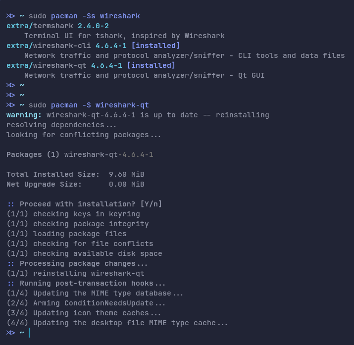
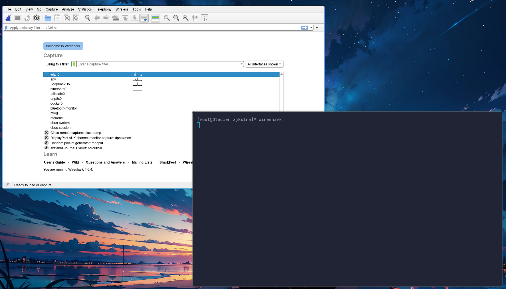
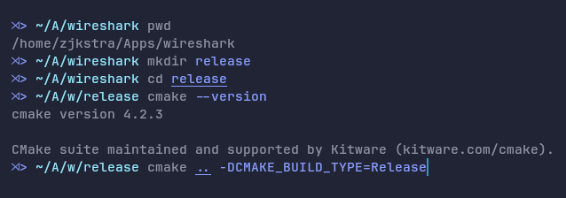

# Week 1 - Instalasi Wireshark Linux


## Pacman (Recommended)

1. Install menggunakan package manager karena [wireshark](https://www.wireshark.org/#download) hanya menyediakan source code



2. Selanjutnya jalankan wireshark sebagai root user (bukan sudo)



## Compile Dari Source Code

1. Download [Source Code](https://www.wireshark.org/#download)
2. Extract dengan `tar -xf wireshark-4.6.4.tar.xz` 
3. Rename folder wireshark `mv wireshark-4.6.4 wireshark` (Optional)
4. Selanjutnya [generate build file](https://www.wireshark.org/docs/wsdg_html_chunked/ChSrcBuildFirstTime.html) dengan cmake di folder release



5. Build wireshark dan menambahkan wireshark ke `$PATH` dengan perintah
```bash
release$ make
release$ sudo make install
```
6. Jalankan wireshark dengan root user (bukan sudo)
7. Uninstall wireshark dengan perintah 
```bash
release$ sudo make uninstall
```


