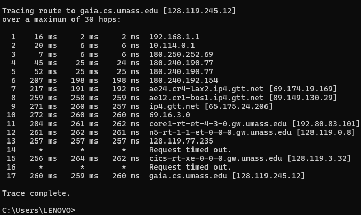
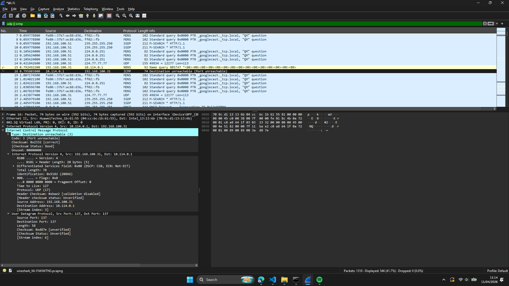
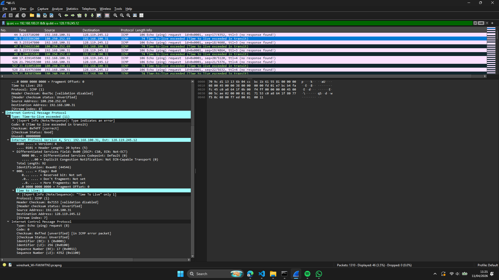
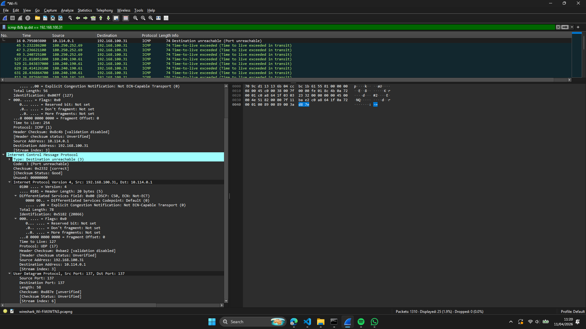
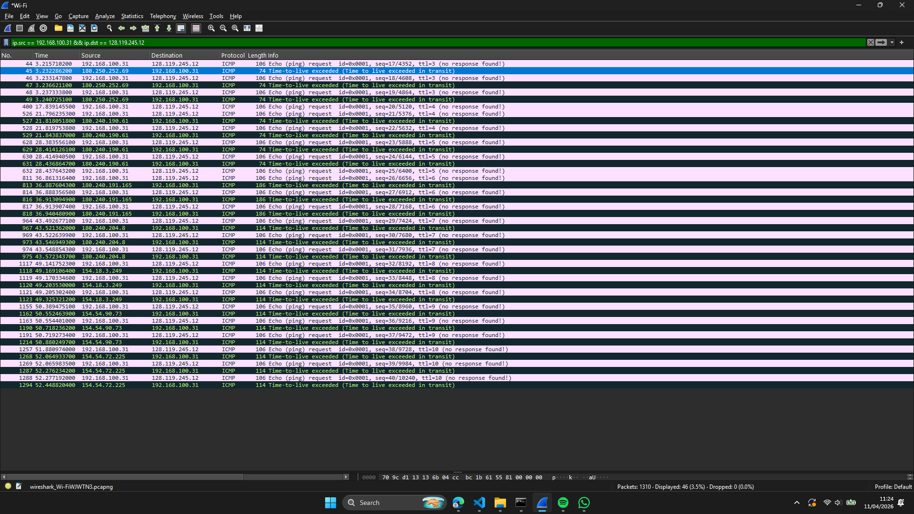
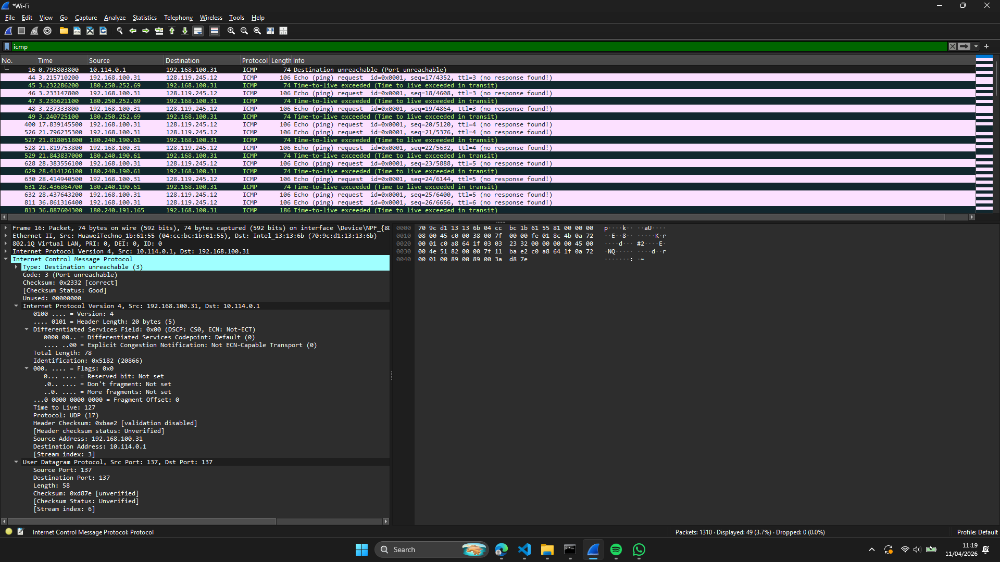

# Laporan Praktikum Jaringan Komputer - Modul 10
## Analisis Internet Protocol (IP)

---

## 10.1 Langkah Praktikum

### 10.1.1 Menangkap Paket Traceroute

**Tahapan:**

1. **Mulai capture pada Wireshark**
   - Buka Wireshark lalu pilih interface yang aktif (Wi-Fi)
   - Tekan tombol Start Capture

2. **Jalankan traceroute**
   ```cmd
   # Windows
   tracert gaia.cs.umass.edu
   ```

3. **Hentikan capture seusai traceroute rampung**

4. **Saring paket di Wireshark:**
   ```
   icmp && ip.dst == 192.168.100.31
   ```

---

## 10.2 Hasil Praktikum

### 10.2.1 Bagian 1: Analisis Dasar IPv4

**Filter Wireshark yang Dipakai:**
```
ip.src == 192.168.100.31 && ip.dst == 128.119.245.12
```

**Hasil Tangkapan Wireshark:**



**Hasil tracert menuju gaia.cs.umass.edu (128.119.245.12):**

| Hop | IP Router | RTT (ms) | Keterangan |
|-----|-----------|----------|------------|
| 1 | 192.168.1.1 | 2 | Gateway lokal |
| 2 | 10.114.0.1 | 6 | Router ISP |
| 3 | 180.250.252.69 | 6 | Router ISP lanjutan |
| 4–5 | 180.240.190.77 | 24–25 | — |
| 6 | 180.240.192.154 | 198 | — |
| 7 | ae24.cr4-lax2.ip4.gtt.net [69.174.19.169] | 192 | GTT Los Angeles |
| 8 | ae12.cr1-bos1.ip4.gtt.net [89.149.130.29] | 259 | GTT Boston |
| 11 | core1-rt-et-4-3-0.gw.umass.edu [192.80.83.101] | 262 | Jaringan UMass |
| 12 | n5-rt-1-1-et-0-0-0.gw.umass.edu [128.119.0.8] | 261 | — |
| 17 | gaia.cs.umass.edu [128.119.245.12] | 260 | **Tujuan tercapai** |

**Penjelasan:**
- Total **17 hop** hingga destination; hop 14 dan 16 tidak merespons (`* * *`)
- Latensi rendah hingga hop 3 (~6 ms), lalu melonjak setelah masuk jaringan internasional (~198 ms ke atas)
- Rute melewati jaringan **GTT** (Los Angeles → Boston) sebelum masuk jaringan UMass
- Router **180.250.252.69** pada hop 3 adalah titik transisi ke backbone ISP

---

### 10.2.2 Rincian Header IPv4 dan ICMP

**Paket ICMP Destination Unreachable:**



**Susunan ICMP Destination Unreachable:**

```
Internet Control Message Protocol
    Type: 3 (Destination unreachable)
    Code: 3 (Port unreachable)
    Checksum: 0x2332 [correct]
    [Checksum Status: Good]
    Unused: 00000000
```

**Pembahasan:**
- **Type 3** menandakan Destination unreachable
- **Code 3** menandakan Port unreachable
- Hal ini terjadi karena traceroute (tracert Windows) mengirim ke port yang tidak digunakan
- Router **10.114.0.1** mengembalikan pesan galat ini ke **192.168.100.31**

**Header IPv4 di dalam ICMP Error:**
```
Internet Protocol Version 4, Src: 192.168.100.31, Dst: 10.114.0.1
    Version: 4
    Header Length: 20 bytes (5)
    Total Length: 78
    Identification: 0x5182 (20866)
    Flags: 0x00
    Fragment Offset: 0
    Time to Live: 127
    Protocol: UDP (17)
    Source Address: 192.168.100.31
    Destination Address: 10.114.0.1
```

---

### 10.2.3 Telaah ICMP Echo Request (Ping)

**Rincian Frame 44 - ICMP Echo Request:**



**Header IPv4 (Frame 44):**

```
Internet Protocol Version 4, Src: 192.168.100.31, Dst: 128.119.245.12
    0100 .... = Version: 4
    .... 0101 = Header Length: 20 bytes (5)
    Differentiated Services Field: 0x00 (DSCP: CS0, ECN: Not-ECT)
    Total Length: 92
    Identification: 0xae02 (44546)
    Flags: 0x00
    .... ...0 0000 0000 0000 000 = Fragment Offset: 0
    Time to Live: 3
    Protocol: ICMP (1)
    Header Checksum: 0x0000 [validation disabled]
    [Header checksum status: Unverified]
    Source Address: 192.168.100.31
    Destination Address: 128.119.245.12
```

**Header ICMP:**

```
Internet Control Message Protocol
    Type: 8 (Echo (ping) request)
    Code: 0
    Checksum: 0xf7ed [correct]
    [Checksum Status: Good]
    Identifier (BE): 1 (0x0001)
    Identifier (LE): 256 (0x0100)
    Sequence Number (BE): 17 (0x0011)
    Sequence Number (LE): 4352 (0x1100)
    [No response seen]
    Data (64 bytes)
```

**Field Penting pada Header IPv4:**

| Field | Nilai | Kegunaan |
|-------|-------|--------|
| **Version** | 4 | IPv4 |
| **Header Length** | 20 bytes | Panjang header minimum |
| **Total Length** | 92 bytes | Ukuran paket keseluruhan |
| **Identification** | 0xae02 (44546) | Penanda unik tiap paket |
| **Flags** | 0x00 | Tidak ada fragmentasi |
| **Fragment Offset** | 0 | Bukan sebuah fragment |
| **Time to Live (TTL)** | 3 | Akan kedaluwarsa setelah 3 hop |
| **Protocol** | ICMP (1) | Protokol lapisan di atasnya |
| **Source IP** | 192.168.100.31 | IP komputer pengirim |
| **Destination IP** | 128.119.245.12 | gaia.cs.umass.edu |

---

### 10.2.4 Telaah ICMP Time-to-Live Exceeded

**Rincian ICMP Type 11:**



**Susunan ICMP TTL-Exceeded:**

```
Internet Control Message Protocol
    Type: Time-to-live exceeded (11)
    [Expert Info (Note/Response): Type indicates an error]
    Code: 0 (Time to live exceeded in transit)
    Checksum: 0xf4ff [correct]
    [Checksum Status: Good]
    Unused: 00000000
```

**Pembahasan:**
- **Type 11** menandakan Time-to-live exceeded
- **Code 0** menandakan TTL habis saat transit
- Dikirim oleh router **180.250.252.69** menuju **192.168.100.31**
- Router menurunkan TTL paket asli hingga 0, lalu mengirimkan galat ini

**Original Datagram (di dalam ICMP error):**
```
Internet Protocol Version 4, Src: 192.168.100.31, Dst: 128.119.245.12
    Time to Live: 1
    Protocol: ICMP (1)
```
Terlihat TTL asli bernilai 1, yang telah kedaluwarsa di router ini.

---

### 10.2.5 Telaah TTL (Time to Live)

**Cara Kerja TTL pada Traceroute:**



**Penjelasan:**

| TTL | Hop yang Tercapai | Respons Router |
|-----|------------------|-----------------|
| 1 | Router 1 (192.168.100.1) | ICMP TTL-exceeded |
| 2 | Router 2 (10.159.118.1) | ICMP TTL-exceeded |
| 3 | Router 3 (180.250.252.69) | ICMP TTL-exceeded |
| 4 | Router 4 (180.240.190.61) | ICMP TTL-exceeded |
| 5 | Router 5 (180.240.191.165) | ICMP TTL-exceeded |
| ... | ... | ... |
| N | Destination (128.119.245.12) | ICMP Echo Reply |

**Dari Tangkapan Layar:**
- **Frame 44, 46, 48**: TTL = 3
- **Frame 400, 526**: TTL = 4  
- **Frame 628, 630, 631**: TTL = 5
- **Frame 811, 813**: TTL = 6
- **Frame 1117, 1119**: TTL = 8
- **Frame 1257, 1268**: TTL = 10

Tampak TTL meningkat secara berangsur (3, 4, 5, 6, 8, 10...), selaras dengan cara kerja traceroute.

---

### 10.2.6 Filter dan Telaah Paket

**Filter yang Dipakai:**

1. **Menampilkan seluruh ICMP:**
   ```
   icmp
   ```

2. **Menampilkan ICMP menuju komputer lokal:**
   ```
   icmp && ip.dst == 192.168.100.31
   ```

3. **Menampilkan paket menuju tujuan:**
   ```
   ip.src == 192.168.100.31 && ip.dst == 128.119.245.12
   ```

**Hasil Filter:**



---

### 10.2.7 Bagian 2: Fragmentasi IP

**Catatan Penting:**

Pada capture ini, **fragmentasi tidak tampak** karena:

1. **Ukuran paket kecil**: Total Length = 92 bytes (atau 78 bytes pada beberapa paket)
2. **MTU jaringan Ethernet** = 1500 bytes
3. **92 < 1500**, sehingga **tidak perlu fragmentasi**

**Flags pada Header IPv4 (dari tangkapan layar):**
```
Flags: 0x00
    0... .... = Reserved bit: Not set
    .0.. .... = Don't fragment: Not set
    ..0. .... = More fragments: Not set
    ...0 0000 0000 0000 000 = Fragment Offset: 0
```

Terlihat **MF (More Fragments) = 0** dan **Fragment Offset = 0**, yang menegaskan bahwa paket tidak terfragmentasi.

**Teori Fragmentasi:**

Apabila datagram 3000 bytes dikirim melalui jaringan ber-MTU 1500 bytes:

| Fragment | Total Length | Fragment Offset | Flags (MF) |
|----------|--------------|-----------------|------------|
| 1 | 1500 bytes | 0 | MF=1 (More Fragments) |
| 2 | 1500 bytes | 1480 | MF=1 (More Fragments) |
| 3 | 60 bytes | 2960 | MF=0 (Last fragment) |

**Perhitungan:**
```
Datagram asli: 3000 bytes
MTU: 1500 bytes
Header IP: 20 bytes
Payload maksimal tiap fragment: 1500 - 20 = 1480 bytes

Fragment 1: Offset 0,     Length 1500 (20 header + 1480 data)
Fragment 2: Offset 1480,  Length 1500 (20 header + 1480 data)  
Fragment 3: Offset 2960,  Length 60   (20 header + 40 data)
```

**Field Fragmentasi pada Header IPv4:**
- **Identification**: Sama bagi seluruh fragment (contoh 0x5678)
- **Flags MF**: 
  - MF=1 → masih ada fragment lanjutan
  - MF=0 → fragment penghabisan
- **Fragment Offset**: Posisi fragment dalam satuan byte (dibagi 8)

**Alasan tracert Windows Tidak Dapat Memicu Fragmentasi:**
- `tracert` Windows memakai ICMP Echo Request berukuran tetap (default 32-64 bytes data)
- Tidak tersedia opsi untuk menyetel ukuran paket besar
- `traceroute` pada Linux/Mac dapat menyetel ukuran lewat opsi `-l` atau argumen langsung

---

### 10.2.8 Bagian 3: Sekilas IPv6

**Catatan:** 

Capture yang dilakukan masih bertumpu pada **IPv4** karena:
- Jaringan yang dipakai (Wi-Fi lokal) masih IPv4
- tracert Windows secara default memilih IPv4
- Target gaia.cs.umass.edu menghasilkan alamat IPv4 (128.119.245.12)

**Untuk menelaah IPv6**, diperlukan:
- Jaringan yang mendukung IPv6
- Atau memakai berkas trace `ip-wireshark-trace2-1.pcapng` dari modul
- Akses ke situs yang mendukung IPv6 (youtube.com, google.com)

**Teori IPv6:**

**Perbandingan IPv4 dan IPv6:**

| Fitur | IPv4 | IPv6 |
|-------|------|------|
| **Panjang Alamat** | 32 bit (4 bytes) | 128 bit (16 bytes) |
| **Header Length** | Bervariasi (20-60 bytes) | Tetap (40 bytes) |
| **Fragmentasi** | Di router dan host | Hanya di host sumber |
| **Checksum** | Ada di header | Tidak ada (mengandalkan layer lain) |
| **Options** | Ada (panjang bervariasi) | Extension headers |
| **Contoh Alamat** | 192.168.1.1 | 2001:0db8::1 |

**Contoh Alamat IPv6 (secara teori):**
```
Source:      2404:c0b0:99fc:4326:11cf:5e7f:55d1
Destination: 2607:f8b0:4004:800::200e
```

**DNS AAAA Record:**
- Type AAAA dipakai untuk memetakan nama domain ke alamat IPv6
- Berbeda dari Type A yang dipakai untuk IPv4

---

## 10.3 Analisis Praktikum

### 10.3.1 Mekanisme Traceroute

**Mengacu pada hasil capture:**

**Alur Traceroute:**

1. **Client mengirim ICMP Echo Request** dengan TTL=1
   ```
   Src: 192.168.100.31 → Dst: 128.119.245.12
   TTL: 1
   ```

2. **Router 1** (192.168.100.1) menurunkan TTL menjadi 0
   - TTL = 0 → paket dibuang
   - Router mengirim **ICMP Type 11** (TTL-exceeded) ke client

3. **Client mengirim ICMP Echo Request** dengan TTL=2
   ```
   TTL: 2
   ```

4. **Router 2** menurunkan TTL menjadi 0
   - Mengirim ICMP TTL-exceeded

5. **Proses berlanjut** dengan TTL yang terus bertambah (3, 4, 5, ...)

6. **Sampai tujuan tercapai** (TTL cukup besar)
   - Destination mengirim ICMP Echo Reply (Type 0)

**Dari Data Capture:**

| Hop | IP Router | Dari Frame | TTL Request |
|-----|-----------|------------|-------------|
| 1 | 192.168.100.1 | - | 1 |
| 2 | 10.159.118.1 | - | 2 |
| 3 | 180.250.252.69 | 45, 47, 49 | 3 |
| 4 | 180.240.190.61 | 527, 529 | 4 |
| 5 | 180.240.191.165 | 813, 816 | 6 |
| 6 | 180.240.204.8 | 967, 973 | 7 |
| 7 | 154.18.3.249 | 1118, 1120 | 8 |
| 8 | 154.54.90.73 | 1162, 1190 | 10 |
| 9 | 154.54.72.225 | 1268, 1287 | 10 |

**Destination:** 128.119.245.12 (gaia.cs.umass.edu)

---

### 10.3.2 Jenis-Jenis Pesan ICMP

**Yang terlihat pada capture:**

| Type | Code | Pesan | Keterangan |
|------|------|---------|------------|
| **8** | 0 | Echo (ping) request | Dari client ke server |
| **11** | 0 | Time-to-live exceeded | Dari router ketika TTL=0 |
| **3** | 3 | Destination unreachable | Port tidak tersedia |

**Penjelasan:**

1. **Type 8 - Echo Request:**
   - Dikirim oleh traceroute
   - Memuat data 64 bytes
   - Identifier: 0x0001
   - Sequence Number: terus bertambah (17, 18, 19, ...)

2. **Type 11 - TTL Exceeded:**
   - Dikirim oleh router perantara
   - Ketika TTL menyentuh 0
   - Memuat datagram asli pada payload-nya

3. **Type 3 - Destination Unreachable:**
   - Code 3 berarti Port unreachable
   - Dikirim ketika port tujuan tidak tersedia
   - tracert Windows memakai UDP ke port bernomor tinggi

---

### 10.3.3 Field-Field Penting IPv4

**Yang ditelaah dari capture:**

**1. TTL (Time to Live):**
```
Ukuran: 8 bit (0-255)
Fungsi: Mencegah paket berputar tanpa henti
Tiap router menurunkan TTL minimal sebesar 1
Bila TTL = 0 → paket dibuang + dikirim ICMP Type 11
```

**Dari capture:**
- TTL bervariasi: 1, 2, 3, 4, 5, 6, 7, 8, 10...
- Traceroute sengaja menyetel TTL agar terus bertambah

**2. Protocol:**
```
ICMP = 1
TCP = 6
UDP = 17
```

**Dari capture:**
- Protokol = ICMP (1) untuk Echo Request dan TTL-exceeded
- Protokol = UDP (17) untuk sejumlah paket Destination unreachable

**3. Total Length:**
```
Ukuran: 16 bit (maksimal 65535 bytes)
Header + Data
```

**Dari capture:**
- Total Length = 92 bytes (Echo Request)
- Total Length = 78 bytes (beberapa paket)
- Total Length = 56 bytes (beberapa paket)

**4. Identification:**
```
Unik bagi tiap datagram
Dipakai untuk reassembly fragment
```

**Dari capture:**
- Identification: 0xae02 (44546)
- Identification: 0x5182 (20866)
- Identification: 0x007f (127)

**5. Flags:**
```
Bit 0: Reserved (harus 0)
Bit 1: DF (Don't Fragment)
Bit 2: MF (More Fragments)
```

**Dari capture:**
```
Flags: 0x00
    0... .... = Reserved: Not set
    .0.. .... = Don't fragment: Not set
    ..0. .... = More fragments: Not set
```
→ Paket tidak terfragmentasi

---

## 10.4 Simpulan

Berdasarkan praktikum yang sudah dijalankan:

### **1. Protokol IP berhasil ditelaah**
Memakai Wireshark melalui capture paket traceroute (tracert) menuju gaia.cs.umass.edu (128.119.245.12)

### **2. Header IPv4 memuat field-field penting:**
Field yang berhasil ditelaah:
- **Version**: 4 (IPv4)
- **Header Length**: 20 bytes
- **Total Length**: 92 bytes (pada capture)
- **TTL (Time to Live)**: Bervariasi (1, 2, 3, 4, 5, 6, 7, 8, 10...)
- **Protocol**: ICMP (1)
- **Identification**: Unik tiap paket (0xae02, 0x5182, dll)
- **Flags**: 0x00 (tanpa fragmentasi)
- **Source & Destination IP**: 192.168.100.31 → 128.119.245.12

### **3. Traceroute beroperasi dengan memanfaatkan TTL:**
Mekanisme yang teramati:
- Mengirim paket dengan **TTL yang terus naik** (1, 2, 3...)
- Router menurunkan TTL dan mengirim **ICMP Type 11** (TTL-exceeded) saat TTL=0
- Client mengenali router dari **Source IP** paket ICMP
- Dari capture terlihat router pada hop 3, 4, 5, 6, 7, 8, 9, 10...

### **4. Pesan ICMP berhasil ditelaah:**
Type yang teramati:
- **Type 8, Code 0**: Echo (ping) request
- **Type 11, Code 0**: Time-to-live exceeded
- **Type 3, Code 3**: Destination unreachable (Port unreachable)

### **5. Fragmentasi IP tidak teramati:**
Alasannya:
- Ukuran paket kecil (**92 bytes < MTU 1500 bytes**)
- tracert Windows tidak mendukung penyetelan ukuran paket besar
- Flags **MF=0** dan **Fragment Offset=0** menegaskan tidak ada fragmentasi
- Diperlukan berkas trace khusus atau Linux/Mac untuk menyaksikan fragmentasi

**Teori fragmentasi dipahami:**
- Datagram 3000 bytes dipecah menjadi 3 fragment
- Tiap fragment memiliki header IP lengkap
- Identification tetap sama, MF flag berbeda, Fragment Offset menunjukkan posisi

### **6. IPv6 tidak teramati:**
Alasannya:
- Jaringan yang dipakai masih IPv4
- tracert Windows secara default mengarah ke IPv4
- Diperlukan berkas trace `ip-wireshark-trace2-1.pcapng` untuk menelaah IPv6

### **7. Wireshark efektif untuk analisis:**
Fitur yang dimanfaatkan:
- Filter `icmp` menampilkan seluruh paket ICMP
- Filter `icmp && ip.dst == 192.168.100.31` memfokuskan pada response
- Filter `ip.src == 192.168.100.31 && ip.dst == 128.119.245.12` untuk request
- Rincian header dapat dibuka dan ditelaah field demi field
- Pewarnaan paket membantu mengenali jenis paket

---
