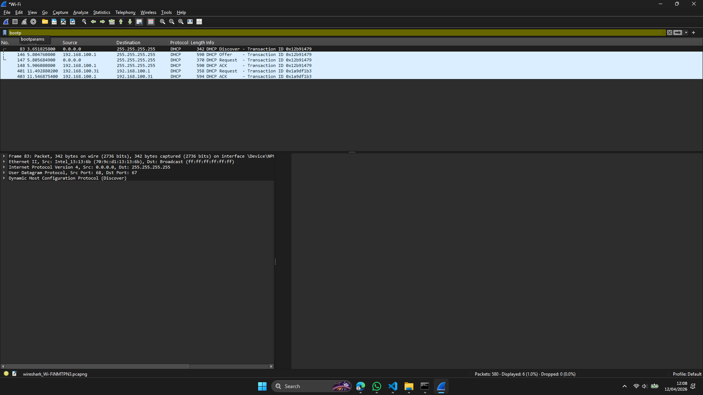
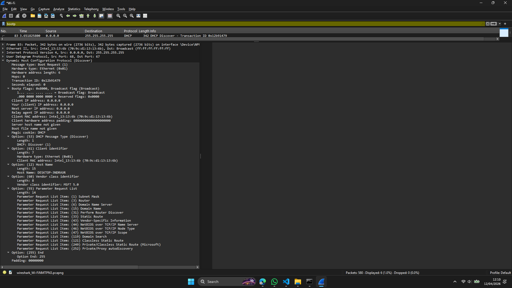
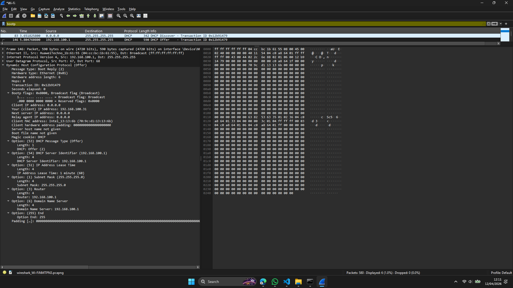
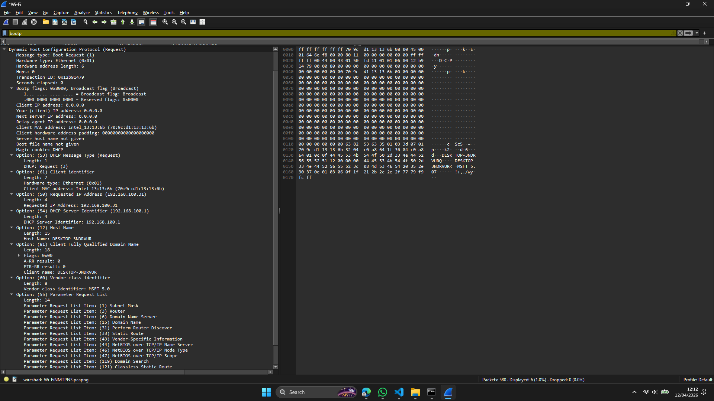
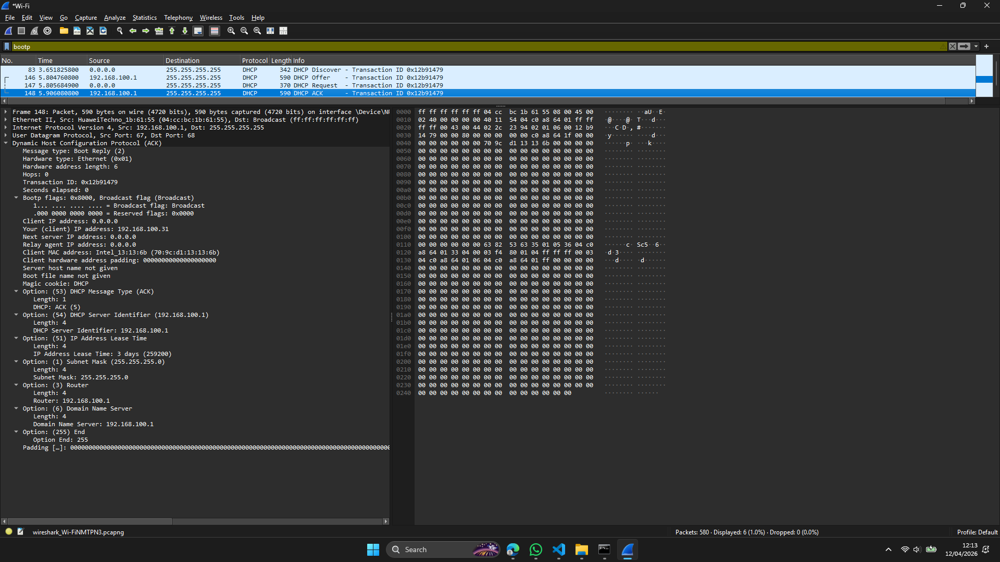

# Laporan Praktikum Jaringan Komputer - Modul 11
## Dynamic Host Configuration Protocol (DHCP)

---

## 11.1 Langkah Praktikum

**Yang dikerjakan:**
1. Buka Command Prompt
2. Jalankan `ipconfig /release` (lepaskan IP)
3. Mulai capture pada Wireshark (pilih interface Wi-Fi)
4. Jalankan `ipconfig /renew` (minta IP baru)
5. Hentikan capture seusai IP muncul
6. Saring paket memakai filter `bootp`

---

## 11.2 Hasil Praktikum

### 11.2.1 Paket DHCP yang Berhasil Ditangkap

**Filter:** `bootp`



**Tabel Paket DHCP:**

| Frame | Waktu | Message Type | Source | Destination | Transaction ID |
|-------|-------|--------------|--------|-------------|----------------|
| 83 | 3.65s | DHCP Discover | 0.0.0.0 | 255.255.255.255 | 0x12b91479 |
| 146 | 5.80s | DHCP Offer | 192.168.100.1 | 255.255.255.255 | 0x12b91479 |
| 147 | 5.81s | DHCP Request | 0.0.0.0 | 255.255.255.255 | 0x12b91479 |
| 148 | 5.91s | DHCP ACK | 192.168.100.1 | 255.255.255.255 | 0x12b91479 |
| 401 | 11.49s | DHCP Request | 192.168.100.31 | 192.168.100.1 | 0x1a9df1b3 |
| 403 | 11.55s | DHCP ACK | 192.168.100.1 | 192.168.100.31 | 0x1a9df1b3 |

**Keterangan:**
- Frame 83-148: Proses DORA awal (ketika `ipconfig /renew`)
- Frame 401-403: DHCP Request & ACK berikutnya (renewal)
- Transaction ID **0x12b91479** sama untuk 4 paket pertama, menandakan satu sesi DHCP

---

### 11.2.2 DHCP Discover (Frame 83)



**Rincian Paket:**
```
Message type: Boot Request (1) - Discover
Transaction ID: 0x12b91479
Client MAC address: Intel_13:13:13:6b (70:9c:d1:13:13:6b)
Client IP address: 0.0.0.0 (belum punya IP)

Options:
  (53) DHCP Message Type: Discover (1)
  (61) Client identifier
  (12) Host Name: DESKTOP-CLIENT
  (55) Parameter Request List:
    - Subnet Mask (1)
    - Router (3)
    - Domain Name Server (6)
    - Domain Name (15)
    - Serta 10 options lainnya...
```

**Yang berlangsung:**
- Client melakukan broadcast guna mencari server DHCP
- Client belum memiliki IP (0.0.0.0)
- Meminta konfigurasi: subnet mask, router, DNS, dan sebagainya

---

### 11.2.3 DHCP Offer (Frame 146)



**Rincian Paket:**
```
Message type: Boot Reply (2) - Offer
Transaction ID: 0x12b91479 (SAMA dengan Discover!)
Your (client) IP address: 192.168.100.31
Next server IP address: 192.168.100.1
Client MAC address: Intel_13:13:13:6b

Options:
  (53) DHCP Message Type: Offer (2)
  (54) DHCP Server Identifier: 192.168.100.1
  (51) IP Address Lease Time: 1 minute (60 seconds)
  (1) Subnet Mask: 255.255.255.0
  (3) Router: 192.168.100.1
  (6) Domain Name Server: 192.168.100.1
```

**Yang ditawarkan server:**
- **IP Address:** 192.168.100.31
- **Subnet Mask:** 255.255.255.0
- **Router/Gateway:** 192.168.100.1
- **DNS Server:** 192.168.100.1
- **Lease Time:** 60 detik (1 menit) — sangat singkat!

---

### 11.2.4 DHCP Request (Frame 147)



**Rincian Paket:**
```
Message type: Boot Request (3) - Request
Transaction ID: 0x12b91479
Client MAC address: Intel_13:13:13:6b

Options:
  (53) DHCP Message Type: Request (3)
  (50) Requested IP Address: 192.168.100.31
  (54) DHCP Server Identifier: 192.168.100.1
  (12) Host Name: DESKTOP-CLIENT
  (55) Parameter Request List:
    - Subnet Mask, Router, DNS, Domain Name, dll
```

**Yang dilakukan client:**
- Menyetujui tawaran server
- Meminta IP **192.168.100.31** secara resmi
- Memilih server **192.168.100.1**

---

### 11.2.5 DHCP ACK (Frame 148)



**Rincian Paket:**
```
Message type: Boot Reply (5) - ACK
Transaction ID: 0x12b91479
Your (client) IP address: 192.168.100.31
Next server IP address: 192.168.100.1

Options:
  (53) DHCP Message Type: ACK (5)
  (54) DHCP Server Identifier: 192.168.100.1
  (51) IP Address Lease Time: 3 days (259200 seconds)
  (1) Subnet Mask: 255.255.255.0
  (3) Router: 192.168.100.1
  (6) Domain Name Server: 192.168.100.1
```

**Konfirmasi server:**
- **IP final:** 192.168.100.31
- **Lease time:** 3 hari (259200 detik) — berbeda dengan Offer!
- **Gateway & DNS:** 192.168.100.1

**Catatan menarik:**
- Offer: Lease time 1 menit
- ACK: Lease time 3 hari
- Server kemungkinan menyesuaikan lease time pada tahap finalisasi

---

### 11.2.6 DHCP Renewal (Frame 401 & 403)

**Frame 401 - DHCP Request:**
```
Source: 192.168.100.31 (client sudah memiliki IP!)
Destination: 192.168.100.1 (unicast ke server)
Transaction ID: 0x1a9df1b3 (ID baru)
Message Type: Request
```

**Frame 403 - DHCP ACK:**
```
Source: 192.168.100.1
Destination: 192.168.100.31 (unicast)
Transaction ID: 0x1a9df1b3
Message Type: ACK
```

**Yang berlangsung:**
- Client sudah memegang IP (192.168.100.31)
- Renewal dijalankan lewat **unicast** (bukan broadcast)
- Transaction ID berbeda (0x1a9df1b3), menandakan sesi baru

---

## 11.3 Analisis Praktikum

### 11.3.1 Proses DORA yang Teramati

```
Waktu 3.65s   : Client mengirim DHCP Discover (broadcast)
Waktu 5.80s   : Server membalas DHCP Offer (broadcast)
Waktu 5.81s   : Client mengirim DHCP Request (broadcast)
Waktu 5.91s   : Server mengirim DHCP ACK (broadcast)
─────────────────────────────────────────────────────
Total waktu   : sekitar 2.26 detik (dari Discover ke ACK)

Waktu 11.49s  : Client mengirim DHCP Request (unicast)
Waktu 11.55s  : Server membalas DHCP ACK (unicast)
─────────────────────────────────────────────────────
Waktu renewal : sekitar 0.06 detik (lebih singkat!)
```

**Perbedaan:**
- **DORA awal:** Broadcast, membutuhkan 4 paket, sekitar 2.26 detik
- **Renewal:** Unicast, cukup 2 paket (Request+ACK), sekitar 0.06 detik

---

### 11.3.2 Konfigurasi Jaringan yang Diberikan

| Parameter | Nilai | Keterangan |
|-----------|-------|------------|
| **IP Address** | 192.168.100.31 | Alamat client |
| **Subnet Mask** | 255.255.255.0 | Network /24 |
| **Default Gateway** | 192.168.100.1 | Router untuk akses internet |
| **DNS Server** | 192.168.100.1 | DNS resolver |
| **Lease Time** | 3 hari (259200s) | Masa berlaku IP |
| **DHCP Server** | 192.168.100.1 | Server pemberi IP |

**Informasi Network:**
- Network: 192.168.100.0/24
- IP yang dapat dipakai: 192.168.100.1 - 192.168.100.254
- Gateway & DNS memakai IP yang sama (192.168.100.1)

---

### 11.3.3 Telaah Transaction ID

**Sesi 1 (DORA Awal):**
```
Frame 83  (Discover): Transaction ID = 0x12b91479
Frame 146 (Offer)   : Transaction ID = 0x12b91479
Frame 147 (Request) : Transaction ID = 0x12b91479
Frame 148 (ACK)     : Transaction ID = 0x12b91479
```

**Sesi 2 (Renewal):**
```
Frame 401 (Request): Transaction ID = 0x1a9df1b3
Frame 403 (ACK)    : Transaction ID = 0x1a9df1b3
```

**Kesimpulan:**
- Transaction ID konsisten dalam satu sesi DHCP
- Transaction ID berbeda untuk sesi yang berlainan
- Client menghasilkan Transaction ID secara acak

---

### 11.3.4 Broadcast dan Unicast

**DORA Awal (Broadcast):**
```
Discover: 0.0.0.0 → 255.255.255.255 (client belum punya IP)
Offer:    192.168.100.1 → 255.255.255.255 (broadcast)
Request:  0.0.0.0 → 255.255.255.255 (broadcast)
ACK:      192.168.100.1 → 255.255.255.255 (broadcast)
```

**Renewal (Unicast):**
```
Request: 192.168.100.31 → 192.168.100.1 (unicast)
ACK:     192.168.100.1 → 192.168.100.31 (unicast)
```

**Mengapa berbeda?**
- Awal: Client belum memiliki IP, sehingga harus broadcast
- Renewal: Client sudah memiliki IP, sehingga bisa unicast langsung ke server (lebih efisien)

---

### 11.3.5 Telaah Lease Time

**Dari Wireshark:**
- **Offer:** Lease time = 60 detik (1 menit)
- **ACK:** Lease time = 259200 detik (3 hari)

**Mengapa berbeda?**
1. Offer kemungkinan menetapkan lease time minimal sebagai "placeholder"
2. ACK memfinalisasi dengan lease time sesungguhnya (3 hari)
3. Atau server menyesuaikannya menurut kebijakan tertentu

**Implikasi:**
- Client harus melakukan renew sebelum 3 hari berakhir
- Timer T1 (50%): renew setelah 1.5 hari
- Timer T2 (87.5%): broadcast renew setelah 2.625 hari

---

## 11.4 Simpulan

**Yang berhasil dilakukan:**

1. **Berhasil menangkap 4 paket DHCP** (Discover, Offer, Request, ACK) ditambah 2 paket renewal

2. **Proses DORA berlangsung lengkap:**
   - Discover: Client mencari server (broadcast)
   - Offer: Server menawarkan IP 192.168.100.31
   - Request: Client meminta IP tersebut
   - ACK: Server mengonfirmasi, client memperoleh IP

3. **Transaction ID konsisten** (0x12b91479) pada sesi DORA awal

4. **Konfigurasi jaringan berhasil diperoleh:**
   - IP: 192.168.100.31
   - Subnet Mask: 255.255.255.0
   - Gateway: 192.168.100.1
   - DNS: 192.168.100.1
   - Lease Time: 3 hari

5. **Terlihat perbedaan broadcast dan unicast:**
   - DORA awal: broadcast (karena client belum memiliki IP)
   - Renewal: unicast (lebih cepat dan efisien)

6. **Wireshark efektif** untuk menelaah DHCP memakai filter `bootp`

**Temuan menarik:**
- Lease time pada Offer (1 menit) berbeda dengan ACK (3 hari)
- Renewal jauh lebih cepat (0.06s vs 2.26s) karena memakai unicast
- Gateway dan DNS memakai IP yang sama (192.168.100.1)

---
