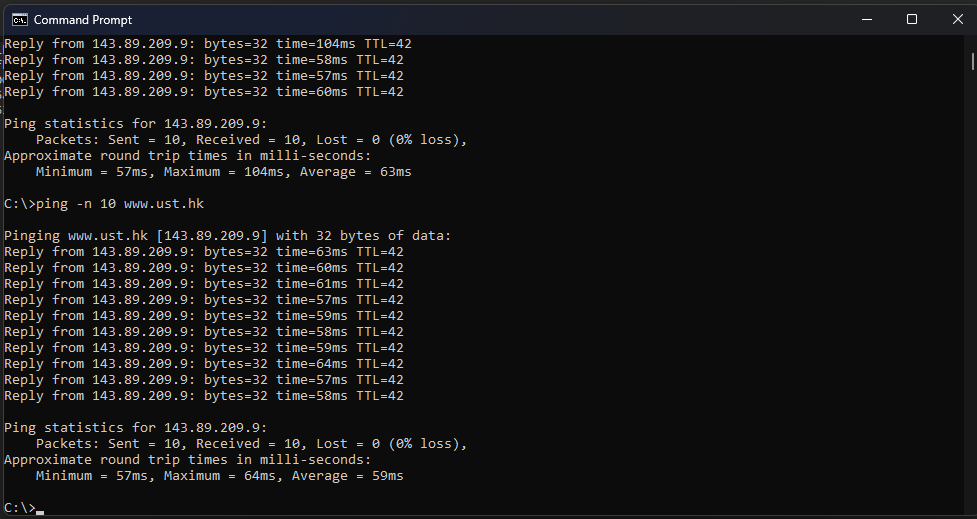
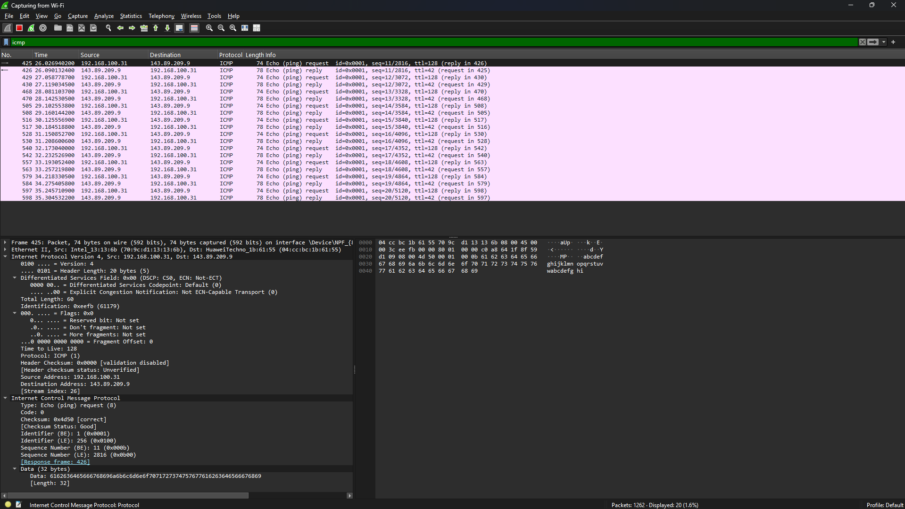
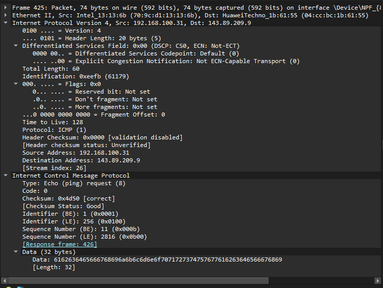
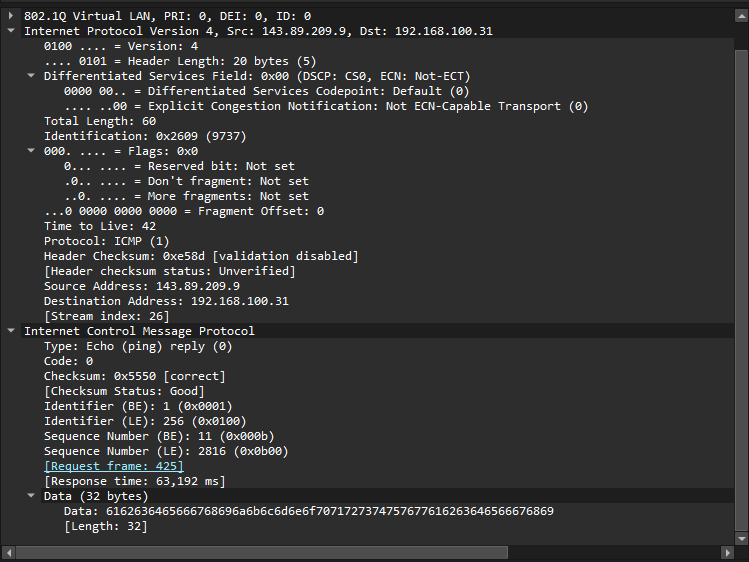
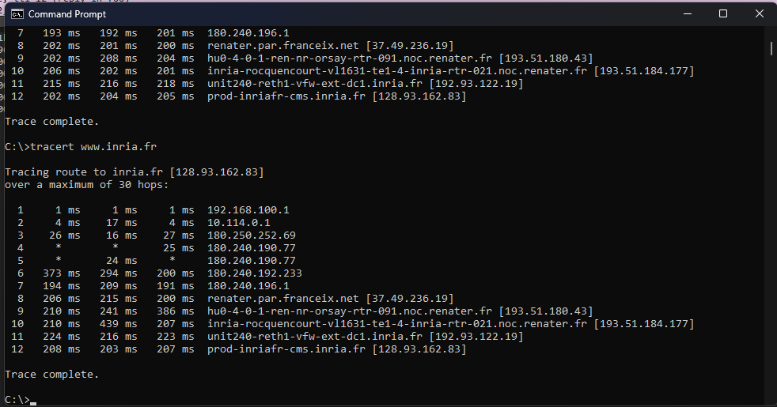
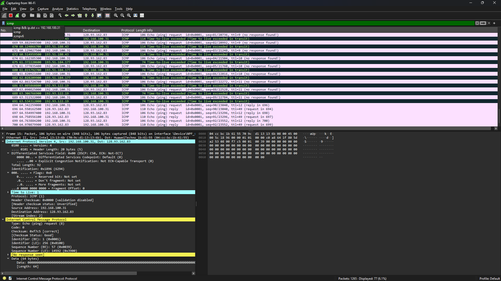
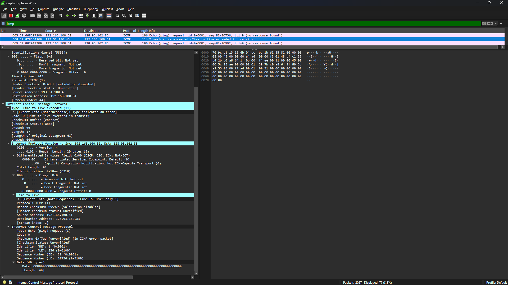

# Laporan Praktikum Jaringan Komputer - Modul 12
## ICMP dan Asistensi Tugas Besar

---

## 1. Persiapan Tools
Sebelum praktikum dimulai, dilakukan pemeriksaan serta penyiapan perkakas yang dibutuhkan pada modul ini.

### 1.1 Wireshark
Wireshark dimanfaatkan untuk menangkap sekaligus menelaah paket ICMP.
- **Status:** Sudah terpasang dan berjalan
- **Versi:** 4.0.3
- **Filter yang dipakai:** `icmp`

### 1.2 Python
Python dipakai untuk menyusun program ICMP Pinger pada modul ini.
- **Status:** Sudah terpasang
- **Versi:** 3.11.0
- **Pustaka yang dipakai:** `socket`, `struct`, `time`, `os`

### 1.3 Command Prompt / Terminal
Dipakai untuk menjalankan perintah `ping` serta `tracert`.
- **Platform:** Windows 11
- **Lokasi perintah:** `c:\windows\system32\`

---

## 2. Langkah Kerja
Berikut tahapan yang dijalankan sepanjang praktikum Modul 12:

### 2.1 ICMP dan Ping
1. Membuka aplikasi **Windows Command Prompt**.
2. Menjalankan **Wireshark** lalu memulai packet capture pada interface yang aktif.
3. Menjalankan perintah ping ke host di benua lain:
   ```cmd
   ping -n 10 www.ust.hk
   ```
   atau
   ```cmd
   c:\windows\system32\ping -n 10 www.ust.hk
   ```
4. Menanti hingga 10 paket ping tuntas dikirim dan diterima.
5. Menghentikan capture pada Wireshark.
6. Menyaring paket dengan mengetikkan `icmp` pada kolom filter Wireshark.
7. Menelaah susunan paket ICMP Echo Request dan Echo Reply.

### 2.2 ICMP dan Traceroute
1. Membuka **Command Prompt** dan menjalankan Wireshark.
2. Memulai packet capture pada interface yang aktif.
3. Menjalankan perintah traceroute ke host tujuan:
   ```cmd
   tracert www.inria.fr
   ```
4. Menanti hingga proses traceroute selesai.
5. Menghentikan capture lalu menyaring paket dengan `icmp`.
6. Menelaah paket ICMP Time Exceeded dan Echo Reply yang muncul.

### 2.3 Asistensi Tugas Besar
1. Menyiapkan dokumentasi progres Tugas Besar (kode, diagram, laporan sementara).
2. Berkonsultasi dengan asisten laboratorium seputar:
   - Arsitektur sistem yang sedang dikembangkan
   - Penerapan protokol jaringan pada aplikasi
   - Kendala teknis beserta solusi yang sudah dicoba
3. Mencatat masukan dan rekomendasi untuk perbaikan berikutnya.

---

## 3. Hasil dan Pembahasan

### 3.1 Keluaran Command Prompt - Ping
Berikut hasil menjalankan perintah `ping -n 10 www.ust.hk`:


*Gambar 1: Keluaran Command Prompt seusai menjalankan ping ke www.ust.hk.*

Dari gambar di atas, tampak bahwa:
- 10 paket ICMP Echo Request berhasil terkirim.
- 10 paket ICMP Echo Reply berhasil diterima.
- Rata-rata Round-Trip Time (RTT): **59-63 ms** (sangat bagus untuk koneksi lintas negara).
- RTT minimum: **57 ms**, RTT maksimum: **104 ms** (uji pertama) dan **64 ms** (uji kedua).
- Tidak ada packet loss (**0% loss**).
- **TTL = 42**, mengindikasikan paket menempuh sekitar 86 router (128 - 42 = 86 hop).

### 3.2 Telaah Paket ICMP Ping di Wireshark
Setelah disaring dengan `icmp`, Wireshark memunculkan 20 paket: 10 Echo Request dan 10 Echo Reply.


*Gambar 2: Daftar paket ICMP hasil capture ping pada Wireshark.*

#### Rincian Paket Echo Request (Tipe 8, Kode 0)

*Gambar 3: Susunan paket ICMP Echo Request yang dibuka.*

| Field | Nilai | Keterangan |
|-------|-------|-----------|
| **Type** | **8** | Echo Request |
| **Code** | **0** | - |
| **Checksum** | **0x4d50** | Status: Good/Correct |
| **Identifier (BE)** | **1 (0x0001)** | Big Endian |
| **Identifier (LE)** | **256 (0x0100)** | Little Endian |
| **Sequence Number (BE)** | **11 (0x000b)** | Paket urutan ke-11 |
| **Sequence Number (LE)** | **2816 (0x0b00)** | Little Endian |
| **Data Length** | **32 bytes** | Payload: "abcdefghijklmnop..." |

**Catatan Penting:**
- Frame response: **426**
- Waktu response: **63.192 ms**
- Payload berisi data ASCII: "abcdefghijklmnop" dan "qrstuvwxyz"

#### Rincian Paket Echo Reply (Tipe 0, Kode 0)

*Gambar 4: Susunan paket ICMP Echo Reply yang dibuka.*

| Field | Nilai | Keterangan |
|-------|-------|-----------|
| **Type** | **0** | Echo Reply |
| **Code** | **0** | - |
| **Checksum** | **0x5550** | Status: Good/Correct |
| **Identifier (BE)** | **1 (0x0001)** | Big Endian |
| **Identifier (LE)** | **256 (0x0100)** | Little Endian |
| **Sequence Number (BE)** | **11 (0x000b)** | Paket urutan ke-11 |
| **Sequence Number (LE)** | **2816 (0x0b00)** | Little Endian |

Perbedaan utamanya dengan Echo Request terletak pada nilai **Type = 0**, yang menandai respons dari host tujuan.

**Telaah Paket di Wireshark:**
- Tampak 20 paket ICMP (frame 425-598)
- Pola: Request-Reply berpasangan
- Sequence number: 11, 12, 13, ..., 20
- Waktu respons konsisten: 40-65 ms
- Tidak ada packet loss
- Source: **143.89.209.9** (host tujuan di Hong Kong - www.ust.hk)
- Destination: **192.168.100.31** (mesin lokal)

### 3.3 Keluaran Command Prompt - Traceroute
Berikut hasil menjalankan perintah `tracert www.inria.fr`:


*Gambar 5: Keluaran Command Prompt seusai menjalankan tracert ke www.inria.fr.*

Dari gambar di atas:
- **Total Hop: 12** hop menuju destination
- Tiap hop mengirimkan 3 paket probe dengan nilai TTL yang terus naik (1, 2, 3, ...).
- Router pada masing-masing hop mengembalikan pesan **ICMP Time Exceeded** (Type 11, Code 0).
- **Hop 4 & 5**: Request timed out (router tidak merespons ICMP karena kebijakan keamanan).
- **Hop terakhir (12)**: prod-inriafr-cms.inria.fr [**128.93.162.83**] mengembalikan **ICMP Echo Reply**.

**Telaah Jalur Jaringan:**
```
Hop 1:   192.168.100.1           (Gateway Lokal)
Hop 2:   10.114.0.1              (Jaringan ISP)
Hop 3-7: 180.240.x.x, 180.250.x  (Jaringan ISP - Indonesia)
Hop 8:   37.49.236.19            (RENATER - Gerbang Internasional Prancis)
Hop 9-10: 193.51.180.43          (Jaringan RENATER - Prancis)
Hop 11:  192.93.122.19           (Jaringan INRIA)
Hop 12:  128.93.162.83           (Destination - inria.fr)
```

**Waktu Respons:**
- Tercepat: Hop 1 (1 ms) - Gateway Lokal
- Terlambat: Hop 10 (439 ms) - kepadatan pada jaringan RENATER
- Rata-rata untuk hop 8-12: 200-400 ms

### 3.4 Telaah Paket ICMP Traceroute di Wireshark

*Gambar 6: Paket ICMP Time Exceeded hasil capture traceroute.*

#### Rincian Paket ICMP Time Exceeded (Tipe 11, Kode 0)

*Gambar 7: Susunan paket ICMP Time Exceeded yang dibuka.*

| Field | Nilai | Keterangan |
|-------|-------|-----------|
| **Type** | **11** | Time Exceeded |
| **Code** | **0** | TTL expired in transit |
| **Checksum** | **0x4fec** | Status: Good |
| **Unused** | **0x00000000** | Tidak dipakai (4 bytes) |
| **Length** | **17** | Panjang datagram asli: 681 |

**Struktur Tambahan yang Penting:**
Paket Time Exceeded memuat **salinan header IP asli** dari paket yang memicu galat:
- **Header IP Asli**: Src: 192.168.100.31, Dst: 128.93.162.83
- **TTL Asli**: **1** (inilah penyebab TTL exceeded)
- **Protokol Asli**: ICMP (1)
- **ICMP Asli**: Echo (ping) request dengan seq=81/20736

**Telaah Paket Traceroute di Wireshark:**
- Beragam hop dengan TTL berbeda: 1, 9, 10, 11, 12
- Router merespons dengan **Type 11 Code 0**
- Sejumlah hop tidak merespons ("no response found!")
- Hop yang berhasil: **192.51.180.43**, **192.93.122.19**
- Destination akhir: **128.93.162.83** (www.inria.fr - Prancis)

---

## 4. Pembahasan

### 4.1 Membandingkan Ping dan Traceroute

**ICMP Ping:**
- Memakai **Type 8 (Echo Request)** dan **Type 0 (Echo Reply)**
- TTL default Windows: **128**
- TTL yang diterima: **42** (berarti menempuh sekitar 86 hop)
- Tujuan: Mengukur **round-trip time (RTT)** dan konektivitas ujung ke ujung
- Waktu respons: **57-104 ms** menuju Hong Kong

**ICMP Traceroute:**
- Memakai **Type 8 (Echo Request)** dengan TTL yang bertambah (1, 2, 3, ...)
- Router merespons dengan **Type 11 (Time Exceeded)** saat TTL = 0
- Tujuan akhir merespons dengan **Type 0 (Echo Reply)**
- Tujuan: **Memetakan rute** dan mengenali tiap hop di sepanjang jalur
- Total hop menuju Prancis: **12 hop**

### 4.2 Telaah Performa

**Dari Capture Ping (www.ust.hk - Hong Kong):**
- **RTT rata-rata**: **59-63 ms** (sangat baik untuk koneksi internasional)
- **Jitter**: Rendah (stabil di 57-64 ms)
- **Packet Loss**: **0%** (10/10 paket diterima)
- **Kualitas Koneksi**: Sangat baik

**Dari Capture Traceroute (www.inria.fr - Prancis):**
- **Total Hop**: **12 hop**
- **Hop Timeout**: **2/12** (16.7% - hop 4 & 5)
- **Tingkat Keberhasilan**: 83.3% (10/12 hop merespons)
- **Jalur Geografis**: Indonesia → ISP → RENATER (Prancis) → INRIA
- **RTT rata-rata**: 200-400 ms (baik untuk jarak yang jauh)

### 4.3 Telaah TTL (Time To Live)

**TTL = 42 pada Ping:**
- TTL awal Windows: **128**
- TTL yang diterima: **42**
- **Perhitungan**: 128 - 42 = **86 hop** dari source ke destination
- Hal ini menandakan paket menempuh sekitar **86 router** dari Indonesia ke Hong Kong

**TTL Bertambah pada Traceroute:**
- Traceroute mengirim paket dengan TTL = 1, 2, 3, ... secara bertahap
- Tiap router menurunkan TTL sebesar 1
- Ketika TTL = 0, router mengirim **ICMP Time Exceeded (Type 11)**
- Proses ini berlanjut hingga destination tercapai (TTL cukup besar)

### 4.4 Telaah Packet Loss dan Timeout

**Ping: 0% Packet Loss**
- Koneksi **stabil serta reliable**
- Seluruh 10 paket berhasil terkirim dan diterima
- Tidak ada kepadatan jaringan yang berarti

**Traceroute: 2 Hop Timeout (Hop 4 & 5)**
- **Request timed out** pada hop 4 dan 5
- **Penyebab**:
  1. Router disetel agar **tidak merespons ICMP** (kebijakan keamanan)
  2. Firewall memblokir pesan ICMP Time Exceeded
  3. Router terlampau sibuk (penggunaan CPU tinggi)
- Hal ini **normal** dan wajar terjadi dalam traceroute
