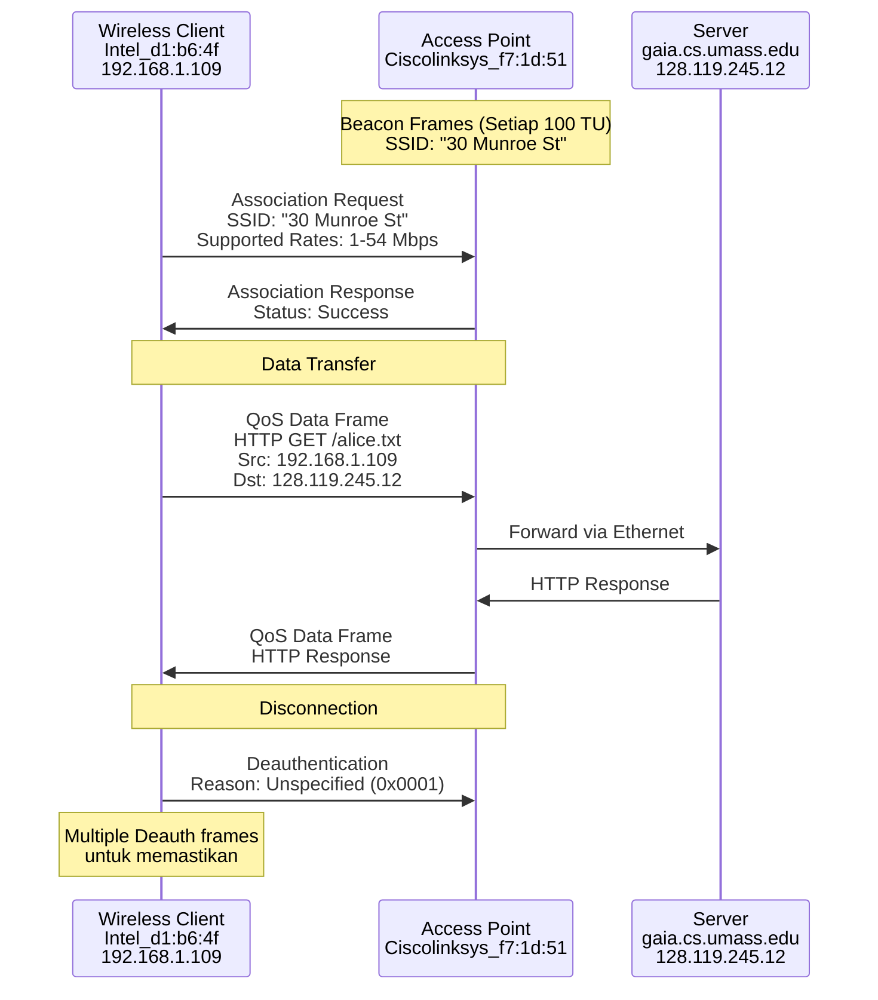

# Laporan Praktikum Jaringan Komputer - Modul 13
## 802.11 WiFi

---

## 1. Persiapan Tools
Karena keterbatasan driver NIC wireless dalam menopang mode monitor untuk menangkap frame 802.11 asli, praktikum ini memanfaatkan berkas trace yang sudah disediakan.

### 1.1 Wireshark
- **Status:** Sudah terpasang dan berjalan
- **Versi:** 4.0.3
- **Filter yang dipakai:** `wlan`, `wlan.fc.type_subtype`, `wlan_mgt`, `http`, `tcp.port == 80`
- **Berkas Trace:** `Wireshark_802_11.pcap` (dari `wireshark-traces.zip`)

### 1.2 Dokumen Rujukan
- *"A Technical Tutorial on the 802.11 Protocol"* - Pablo Brenner
- *"Understanding 802.11 Frame Types"* - Jim Geier
- **ANSI/IEEE Std 802.11, 1999 Edition (R2003)** - [Tautan PDF](http://gaia.cs.umass.edu/wireshark-labs/802.11-1999.pdf)

### 1.3 Spesifikasi Jaringan pada Trace
| Komponen | Keterangan |
|----------|-----------|
| **Access Point** | Cisco Linksys 802.11 (30 Munroe St) |
| **Channel** | 6 (2.437 GHz) |
| **Host Wireless** | Intel wireless NIC (Intel_d1:b6:4f) |
| **Capture Tool** | AirPcap + Wireshark |

---

## 2. Langkah Kerja
Berikut tahapan yang dijalankan sepanjang praktikum Modul 13:

### 2.1 Persiapan dan Memuat Trace
1. Mengunduh berkas `wireshark-traces.zip` dari `http://gaia.cs.umass.edu/wireshark-labs/`.
2. Mengekstrak berkas `Wireshark_802_11.pcap`.
3. Membuka Wireshark lalu memuat berkas trace lewat `File > Open`.
4. Mengamati tampilan awal daftar paket.

### 2.2 Telaah Beacon Frame
1. Menyaring paket dengan `wlan.fc.type_subtype == 8` (Beacon).
2. Memilih salah satu frame Beacon milik AP "30 Munroe St" (Frame 4).
3. Menelaah field-field pada IEEE 802.11 Management Frame:
   - Beacon Interval, Capability Information
   - SSID, Supported Rates, Extended Supported Rates
   - ERP Information, tag Vendor Specific (WMM/WME)

### 2.3 Telaah Transfer Data (HTTP melalui 802.11)
1. Menyaring paket dengan `tcp.port == 80` guna menemukan trafik HTTP.
2. Mengenali paket HTTP GET pada frame 480.
3. Menelaah susunan frame 802.11 Data yang membawa payload IP/HTTP:
   - Frame Control, Duration, Address 1-4
   - Field QoS Control
   - Payload: LLC/SNAP + IP + TCP + HTTP

### 2.4 Telaah Association/Disassociation
1. Menyaring paket management dengan `wlan.fc.type_subtype == 0` untuk Association Request.
2. Menyaring dengan `wlan.fc.type_subtype == 12` untuk Deauthentication.
3. Menelaah frame:
   - **Deauthentication** (Subtype: 12) beserta reason code
   - **Association Request** (Subtype: 0) menuju AP "30 Munroe St"
   - Supported Rates dan QoS Capability

---

## 3. Hasil dan Pembahasan

### 3.1 Tampilan Awal Wireshark dengan Trace 802.11

*Gambar 1: Tampilan Wireshark setelah membuka berkas Wireshark_802_11.pcap berisi beragam frame 802.11.*

### 3.2 Telaah Beacon Frame
Beacon frame dipakai AP untuk mengumumkan keberadaan jaringan.

**Filter:** `wlan.fc.type_subtype == 8`


*Gambar 2: Rincian Beacon Frame milik AP "30 Munroe St" (Frame 4).*

#### Field Penting Beacon Frame
| Field | Nilai | Keterangan |
|-------|-------|-----------|
| **Frame Control** | Type: Management (0), Subtype: Beacon (8) | Jenis frame |
| **Source MAC** | Ciscolinksys_f7:1d:51 | MAC Address AP |
| **Destination** | Broadcast (ff:ff:ff:ff:ff:ff) | Dikirim ke seluruh station |
| **Beacon Interval** | 100 TU (102.4 ms) | Frekuensi pengiriman beacon |
| **SSID** | "30 Munroe St" | Nama jaringan |
| **Supported Rates** | 1, 2, 5.5, 11, 6, 9, 12, 18 Mbps | Kecepatan dasar |
| **Extended Supported Rates** | 24, 36, 48, 54 Mbps | Kecepatan tambahan (802.11g) |
| **ERP Information** | Present | Extended Rate PHY (802.11g) |
| **DS Parameter Set** | Channel: 6 | Channel operasi AP |

#### Tag Vendor Specific
Beacon frame turut memuat informasi vendor-specific:

**1. Airgo Networks, Inc. (Tag 221)**
- OUI: 00:0a:f5
- Data vendor specific untuk fitur proprietary

**2. Microsoft Corp. - WMM/WME Parameter Element (Tag 221)**
- OUI: 00:50:f2 (Microsoft)
- Type: WMM/WME (0x02)
- WME Subtype: Parameter Element (1)
- WME Version: 1
- WME QoS Info: 0x0f
  - U-APSD: Disabled
  - Parameter Set Count: 0xf

**Parameter AC (Access Category) untuk QoS:**
| AC | AIFSN | ECWmin/max | TXOP Limit |
|----|-------|------------|------------|
| **AC 0 (Best Effort)** | 3 | 4/10 (15/1023) | 0 |
| **AC 1 (Background)** | 7 | 4/10 (15/1023) | 0 |
| **AC 2 (Video)** | 2 | 3/4 (7/15) | 94 |
| **AC 3 (Voice)** | 2 | 2/3 (3/7) | 47 |

> **Catatan:** Parameter QoS (WMM) memperlihatkan prioritas bagi tipe trafik yang berbeda. Voice dan Video memperoleh TXOP Limit yang lebih besar demi kualitas layanan yang lebih baik.

### 3.3 Telaah Association Request
**Filter:** `wlan.fc.type_subtype == 0`


*Gambar 3: Frame Association Request dari client wireless Intel menuju AP "30 Munroe St".*

#### Rincian Association Request (Frame 1750)
| Field | Nilai | Keterangan |
|-------|-------|-----------|
| **Frame Control** | Type: Management, Subtype: Association Request (0) |
| **Transmitter Address** | Intel_d1:b6:4f (00:13:02:d1:b6:4f) | MAC client |
| **Receiver Address** | Ciscolinksys_f7:1d:51 (00:16:b6:f7:1d:51) | MAC AP |
| **BSSID** | Ciscolinksys_f7:1d:51 | MAC AP |
| **Sequence Number** | 1648 |
| **Capability Info** | 0x0c01 |
| **Listen Interval** | 0x000a (10 beacon interval) |
| **SSID** | "30 Munroe St" (Length: 12) |

#### Supported Rates dalam Association Request
**Tag: Supported Rates (Tag 1):**
- 1(B), 2(B), 5.5(B), 11(B) - Basic rates (802.11b)
- 6(B), 9, 12(B), 18 Mbps - Basic rates (802.11g)

**Tag: Extended Supported Rates (Tag 50):**
- 24(B), 36, 48, 54 Mbps - Extended rates

**Tag: QoS Capability (Tag 46):**
- QoS Information (STA): 0x00
- Client mendukung QoS/WMM

### 3.4 Telaah Frame Deauthentication
**Filter:** `wlan.fc.type_subtype == 12`


*Gambar 4: Frame Deauthentication dari client menuju AP.*

#### Rincian Deauthentication (Frame 1735)
| Field | Nilai | Keterangan |
|-------|-------|-----------|
| **Frame Control** | Type: Management, Subtype: Deauthentication (12) |
| **Source Address** | Intel_d1:b6:4f (00:13:02:d1:b6:4f) |
| **Destination Address** | Ciscolinksys_f7:1d:51 (00:16:b6:f7:1d:51) |
| **BSSID** | Ciscolinksys_f7:1d:51 |
| **Reason Code** | 0x0001 (Unspecified reason) |

**Penjelasan:** Client mengirim frame Deauthentication untuk memutus koneksi dengan AP. Reason code 1 menandakan "Unspecified reason", yaitu alasan umum bagi terjadinya disconnection.

Tampak beberapa frame deauthentication berturut-turut (frame 1735, 2142, 2143, 2144, 2145, 2146, 2147, 2148, 2149) yang dikirim secara berulang, menunjukkan client berupaya memastikan AP menerima pemberitahuan deauthentication.

### 3.5 Telaah Transfer Data HTTP melalui 802.11
**Filter:** `tcp.port == 80`


*Gambar 5: Frame 802.11 Data yang membawa HTTP GET request (Frame 480).*

#### Informasi Paket HTTP
| Field | Nilai |
|-------|-------|
| **Frame Number** | 480 |
| **Time** | 24.828253 detik |
| **Source IP** | 192.168.1.109 |
| **Destination IP** | 128.119.245.12 (gaia.cs.umass.edu) |
| **Protokol** | HTTP |
| **Request** | GET /wireshark-labs/alice.txt HTTP/1.1 |

#### Susunan Address pada Frame 802.11 Data (Mode Infrastructure)
| Field Address | Nilai | Peran |
|--------------|-------|-------|
| **Receiver Address (RA)** | Ciscolinksys_f4:eb:a8 (00:16:b6:f4:eb:a8) | MAC AP (Address 1) |
| **Transmitter Address (TA)** | Intel_d1:b6:4f (00:13:02:d1:b6:4f) | MAC Client (Address 2) |
| **Destination Address (DA)** | Ciscolinksys_f4:eb:a8 (00:16:b6:f4:eb:a8) | MAC AP (Address 3) |
| **Source Address (SA)** | Intel_d1:b6:4f (00:13:02:d1:b6:4f) | MAC Client (Address 4 - alamat STA) |
| **BSSID** | Ciscolinksys_f7:1d:51 (00:16:b6:f7:1d:51) | MAC AP |

> **Penting:** Frame 802.11 memakai 4 field address pada mode infrastructure, berbeda dengan Ethernet yang hanya memakai 2 address (source dan destination).

#### Field Frame Control
```
Type/Subtype: QoS Data (0x0028)
  Type: Data frame (2)
  Subtype: 8 (QoS Data)
  
Flags: 0x01
  DS status: Frame from STA to DS via an AP (To DS: 1 From DS: 0)
  More Fragments: This is the last fragment
  Retry: Frame is not being retransmitted
  PWR MGT: STA will stay up
  More Data: No data buffered
  Protected flag: Data is not protected
  +HTC/Order flag: Not strictly ordered
```

#### Field QoS Control
```
QoS Control: 0x0000
  TID: 0 (Best Effort)
  Priority: Best Effort (0)
  Ack Policy: Normal Ack (0x0)
  Payload Type: MSDU
  TXOP Duration Requested: 0 (no TXOP requested)
```

#### Susunan Payload
```
IEEE 802.11 Data Frame Body:
├─ LLC/SNAP Header
│  ├─ DSAP: 0xaa
│  ├─ SSAP: 0xaa
│  ├─ Control: 0x03
│  └─ OI: 00-00-00 (Null)
├─ SNAP Protocol Type: IPv4 (0x0800)
├─ IP Header
│  ├─ Source: 192.168.1.109
│  ├─ Destination: 128.119.245.12
│  └─ Protocol: TCP (6)
├─ TCP Header
│  ├─ Source Port: 2538
│  ├─ Destination Port: 80 (HTTP)
│  ├─ Seq: 1, Ack: 1
│  └─ Len: 435
└─ HTTP Protocol
   └─ GET /wireshark-labs/alice.txt HTTP/1.1
      Host: gaia.cs.umass.edu
      User-Agent: Mozilla/5.0...
      Accept: text/xml,application/xml...
```

### 3.6 Membandingkan Frame 802.11 dengan Ethernet

| Aspek | Ethernet (802.3) | 802.11 WiFi |
|-------|------------------|-------------|
| **Field Address** | 2 (Source, Destination) | 4 (Address 1-4) |
| **Jenis Frame** | Hanya Data | Management, Control, Data |
| **Akses Medium** | CSMA/CD | CSMA/CA |
| **Frame Check** | FCS (CRC-32) | FCS (CRC-32) |
| **Fragmentasi** | Tidak ada | Didukung |
| **QoS** | 802.1p (VLAN tag) | WMM/WME (802.11e) |
| **Power Management** | Tidak ada | Didukung |

### 3.7 Sequence Number dan Fragment Number
Dari telaah atas frame-frame yang diamati:

**Beacon Frame (Frame 4):**
- Sequence Number: 2854
- Fragment Number: 0

**Association Request (Frame 1750):**
- Sequence Number: 1607
- Fragment Number: 0

**Deauthentication (Frame 1735):**
- Sequence Number: 1605
- Fragment Number: 0

**HTTP Data (Frame 480):**
- Sequence Number: 51
- Fragment Number: 0

> **Catatan:** Sequence Number dipakai untuk mengenali frame sekaligus mendeteksi duplikasi. Fragment Number dipakai bila frame dipecah menjadi beberapa fragmen (seluruh frame pada trace ini tidak terfragmentasi, sehingga Fragment Number = 0).

### 3.8 Lini Masa Komunikasi Wireless



### 3.9 Telaah Pola Trafik

Dari packet list (Gambar 5), tampak pola trafik yang khas:

1. **Beacon Frames (Frame 1, 4, 9, 11, 13, ...)**
   - Dikirim secara berkala oleh AP
   - Sequence Number terus naik (2854, 2855, 2856, ...)
   - Interval: sekitar 100ms (100 TU)

2. **Management Frames**
   - Association Request/Response
   - Probe Request/Response
   - Deauthentication

3. **Data Frames**
   - Frame QoS Data untuk trafik HTTP
   - Frame Acknowledgement

4. **Control Frames**
   - Acknowledgement (ACK)
   - QoS Null function (untuk power management)
