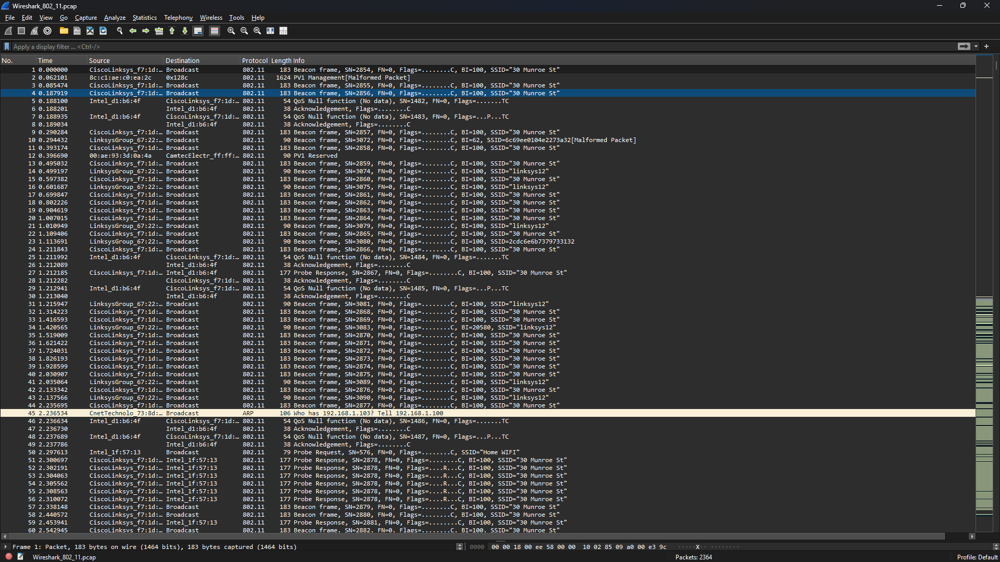
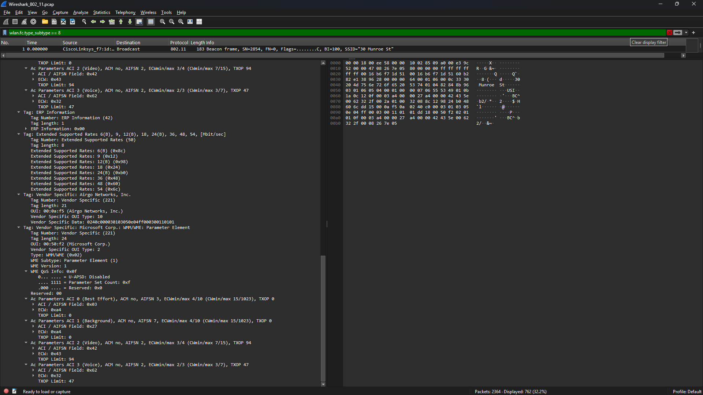
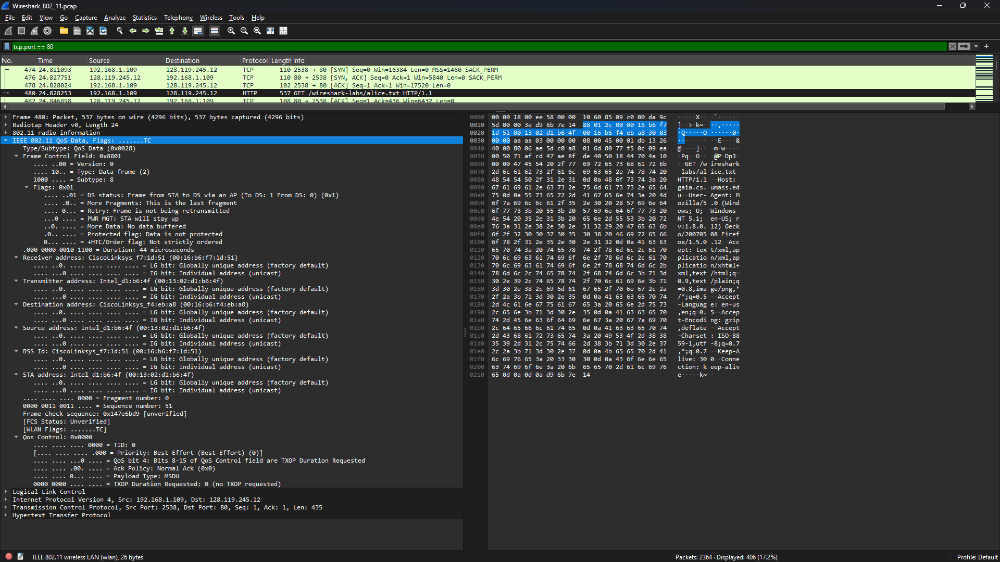
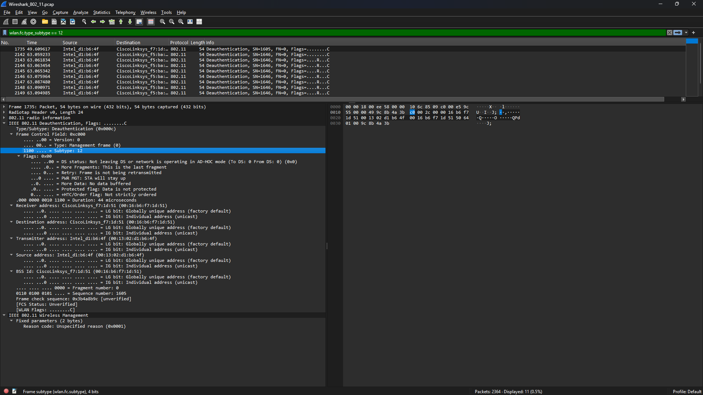
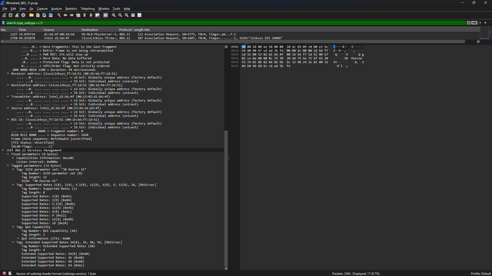

# Laporan Praktikum Jaringan Komputer - Modul 14

## Analisis Protokol IEEE 802.11 (WiFi)

---

# 1. Persiapan

## 1.1 Perangkat Lunak

| Komponen     | Keterangan                                 |
| ------------ | ------------------------------------------ |
| Software     | Wireshark                                  |
| Versi        | 4.0.3                                      |
| File Capture | `Wireshark_802_11.pcap`                    |
| Filter Utama | `wlan`, `wlan.fc.type`, `wlan_mgt`, `http` |

## 1.2 Referensi

1. Pablo Brenner – *A Technical Tutorial on the 802.11 Protocol*
2. Jim Geier – *Understanding 802.11 Frame Types*
3. ANSI/IEEE Std 802.11-1999 (R2003)

## 1.3 Topologi Jaringan pada File Trace

| Komponen      | Keterangan                           |
| ------------- | ------------------------------------ |
| Access Point  | Linksys 802.11g (SSID: 30 Munroe St) |
| Channel       | 6 (2.437 GHz)                        |
| Host Wireless | 1 perangkat klien WiFi               |
| Host Ethernet | 2 perangkat kabel                    |
| Capture Tool  | AirPcap dan Wireshark                |

---

# 2. Langkah Kerja

## 2.1 Membuka File Capture

1. Mengunduh berkas `wireshark-traces.zip`.
2. Mengekstrak berkas `Wireshark_802_11.pcap`.
3. Membuka berkas tersebut memakai Wireshark.
4. Mengamati seluruh paket yang ada pada berkas capture.

## 2.2 Telaah Beacon Frame

1. Memakai filter:

```text
wlan.fc.type_subtype == 0x08
```

2. Memilih salah satu paket Beacon.
3. Mencermati informasi berikut:

* Timestamp
* Beacon Interval
* Capability Information
* SSID
* Supported Rates
* Channel

## 2.3 Telaah Transfer Data

1. Memakai filter:

```text
http
```

2. Menemukan paket HTTP yang dikirim lewat jaringan WiFi.
3. Menelaah susunan frame IEEE 802.11 Data yang membawa payload HTTP.

## 2.4 Telaah Association dan Disassociation

1. Memakai filter:

```text
wlan.fc.type == 0
```

2. Mengenali frame Management.
3. Mencermati proses:

* Disassociation
* Probe Request
* Probe Response
* Association Request
* Association Response

---

# 3. Hasil dan Pembahasan

## 3.1 Tampilan Awal File Capture



**Gambar 1.** Tampilan berkas capture IEEE 802.11 pada Wireshark.

Berkas capture memperlihatkan beragam jenis frame IEEE 802.11 yang terdiri atas frame Management, Control, dan Data. Paket-paket tersebut menopang komunikasi antara klien dan Access Point pada jaringan WiFi.

---

## 3.2 Telaah Beacon Frame



**Gambar 2.** Rincian Beacon Frame.

Beacon Frame termasuk frame Management yang dikirim secara berkala oleh Access Point guna mengumumkan keberadaan jaringan nirkabel kepada perangkat di sekitarnya.

Informasi yang dapat dicermati pada Beacon Frame antara lain:

| Field                  | Fungsi                              |
| ---------------------- | ----------------------------------- |
| Frame Control          | Menetapkan tipe dan subtype frame   |
| Timestamp              | Penanda waktu sinkronisasi jaringan |
| Beacon Interval        | Selang pengiriman Beacon            |
| Capability Information | Informasi kemampuan jaringan        |
| SSID                   | Nama jaringan WiFi                  |
| Supported Rates        | Kecepatan transmisi yang didukung   |
| DS Parameter Set       | Channel yang dipakai                |

Berdasarkan hasil pengamatan, Access Point mengirimkan Beacon secara berkala untuk menyampaikan SSID, channel operasi, serta kemampuan jaringan kepada perangkat klien.

---

## 3.3 Telaah Transfer Data HTTP



**Gambar 3.** Frame Data IEEE 802.11 yang membawa paket HTTP.

Saat klien mengakses halaman web, paket HTTP dikirim lewat frame Data IEEE 802.11. Tidak seperti Ethernet yang hanya memiliki alamat sumber dan tujuan, frame IEEE 802.11 sanggup memuat hingga empat alamat MAC.

### Susunan Alamat pada Frame Data

| Field     | Fungsi                                   |
| --------- | ---------------------------------------- |
| Address 1 | Receiver Address (RA)                    |
| Address 2 | Transmitter Address (TA)                 |
| Address 3 | BSSID                                    |
| Address 4 | Dipakai pada mode tertentu seperti WDS   |

### Susunan Payload

```text
IEEE 802.11 Data Frame
├── MAC Header
├── LLC/SNAP Header
├── IP Header
├── TCP Header
└── HTTP Payload
```

Hasil pengamatan memperlihatkan bahwa frame IEEE 802.11 tidak serta-merta membawa paket IP, melainkan melewati lapisan LLC/SNAP lebih dulu sebelum diteruskan ke protokol IP dan TCP.

---

## 3.4 Telaah Disassociation



**Gambar 4.** Frame Disassociation.

Pada kisaran waktu **49,58 detik**, klien mengirim frame Disassociation yang menandakan bahwa perangkat memutuskan hubungan dengan Access Point yang sedang dipakai.

Frame ini tergolong ke dalam kategori **Management Frame** dan berperan mengakhiri hubungan asosiasi antara klien dan Access Point.

---

## 3.5 Telaah Association



**Gambar 5.** Urutan proses Association.

Seusai proses Disassociation, klien mencari jaringan lain melalui mekanisme:

1. Probe Request
2. Probe Response
3. Association Request
4. Association Response

Pada kisaran waktu **63 detik**, klien kembali berasosiasi ke Access Point **30 Munroe St** dan memperoleh respons sukses dari Access Point.

Proses Association memungkinkan perangkat klien mendapatkan izin untuk bertukar data lewat jaringan WiFi yang dipilih.
