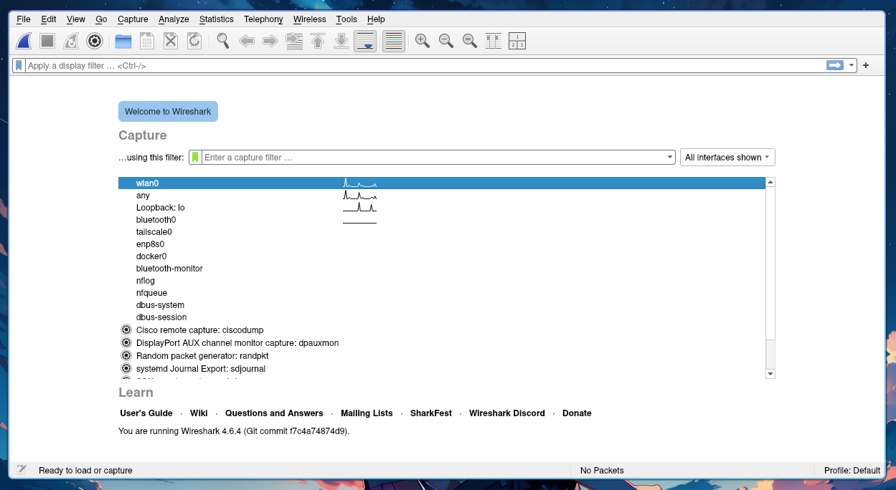
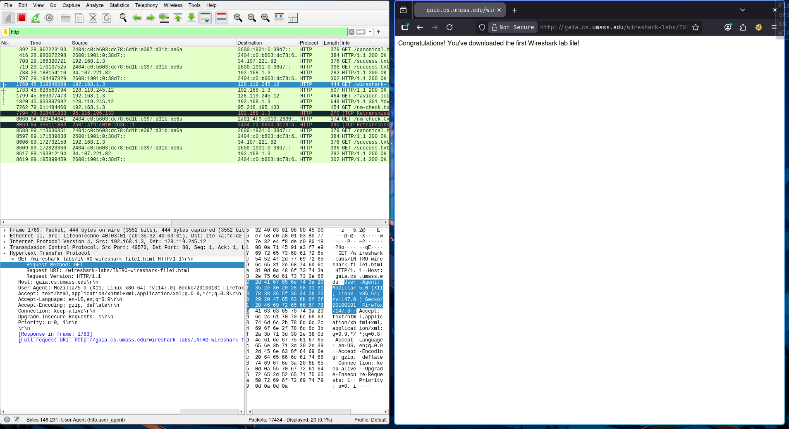

# Week 2 - Penggunaan Wireshark

1. Jalankan wireshark, kemudian pilih interface yang ingin di lihat trafficnya misalnya `wlan0` untuk wireless interface

2. Kemudian sebagai percobaan buka website http://gaia.cs.umass.edu/wireshark-labs/INTRO-wireshark-file1.html dan gunakan `http` untuk memfilter hanya protokol `http` saja yang tampil

Pada panel bagian bawah bisa dilihat detail tentang protokol http