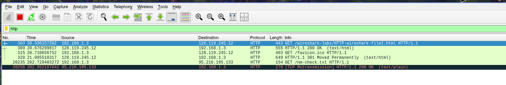
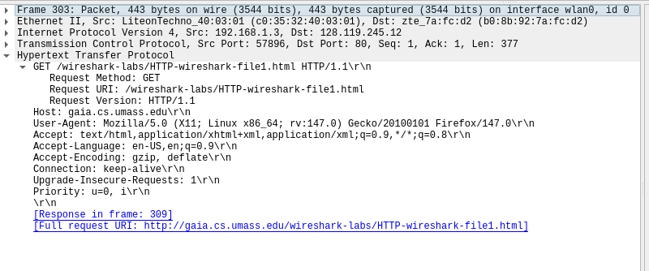
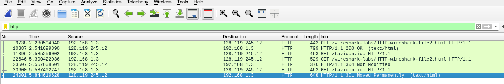
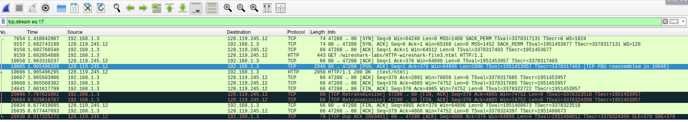
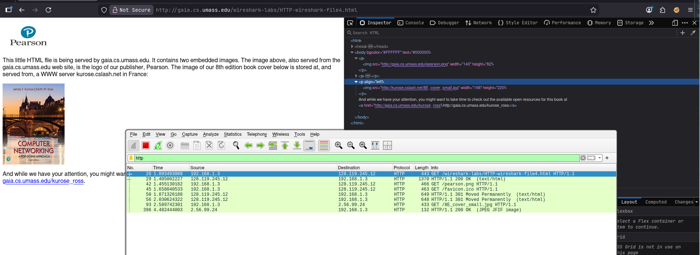
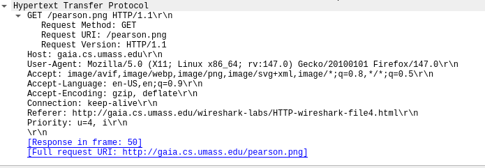
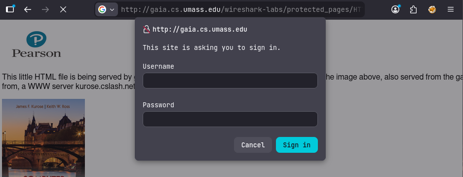
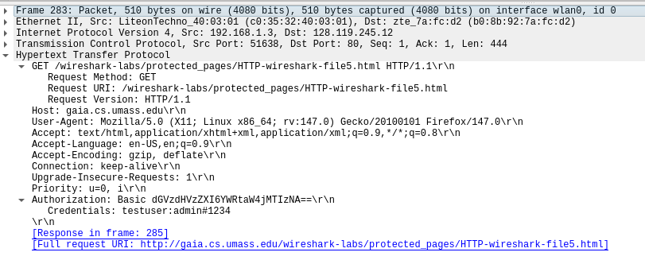

# Week 3 - HTTP

## Basic HTTP Request

Pada basic http request kita coba wireshark untuk melihat traffic http sederhana yang tidak menyertakan objek yang disematkan, dengan cara

1. Buka wireshark dan pilih interface yang tersambung ke jaringan
2. Kemudian buka link berikut di browser 
    `http://gaia.cs.umass.edu/wireshark-labs/HTTP-wireshark-file1.html`
3. Kemudia di wireshark terapkan filter http untuk melihat traffic ke website tersebut

    
    

## HTTP Conditional GET/Response Interaction

1. Pertama hapus cache browser dengan cara menekan CTRL + Shift + delete
2. Kemudian kunjungi link berikut http://gaia.cs.umass.edu/wireshark-labs/HTTP-wireshark-file2.html

    

3. Lakukan refresh pada link tersebut. Pada jendela wireshark terdapat 2 request, request yang kedua adalah konten website diatas yang disimpan di cache browser, sehingga tidak perlu request ke server lagi

## Retrieving Long Document

1. Kali ini diminta untuk request ke http file yang agak panjang http://gaia.cs.umass.edu/wireshark-labs/HTTP-wireshark-file3.html
2. Pada wireshark terapkan filter http, klik kanan pada HTTP GET ke website diatas, pilih Follow > HTTP Stream

    

3. Disini kita akan meihat keseluruhan proses komunikasi dengan website tersebut. Website tersebut memiliki konten HTTP yang agak panjang dan besar untuk satu paket tcp sehingga harus dipisah, wireshark menunjukkan paket tcp yang terpisah yang ditandai dengan "TCP PDU reassembled"

## HTTP Embedded Objects

1. Disini kita akan melihat http request yang dibarengi dengan konten gambar. Terapkan filter http pada wireshark dan kunjungi http://gaia.cs.umass.edu/wireshark-labs/HTTP-wireshark-file4.html
2. Terdapat 2 gambar pada website tersebut yang diambil dari gaia.cs.umass.edu

    
    

## HTTP Authentication

1. Disini kita akan melihat mengapa website http tidak seharusnya mengimplementasikan http authentication, karena tidak diencrypt dan dapat dilihat dengan mudah
2. Pada wireshark filter http dan Kunjungi web http://gaia.cs.umass.edu/wireshark-labs/protected_pages/HTTP-wireshark-file5.html, masukkan random username dan password

    
3. Kita akan melihat traffic biasa pada wireshark, tapi jika diexpand kita akan melihat Basic Authorization dengan user password terbaca dengan jelas

    