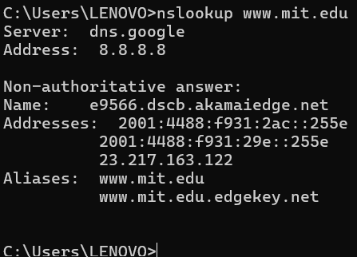
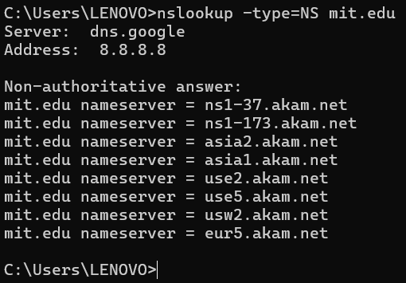
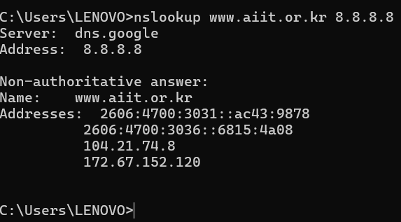
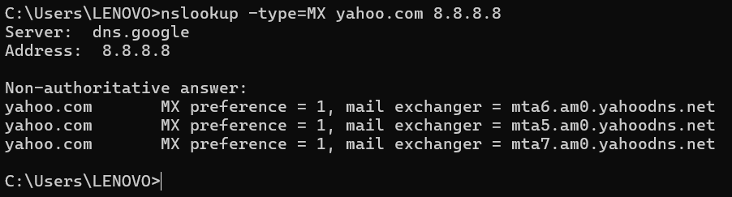
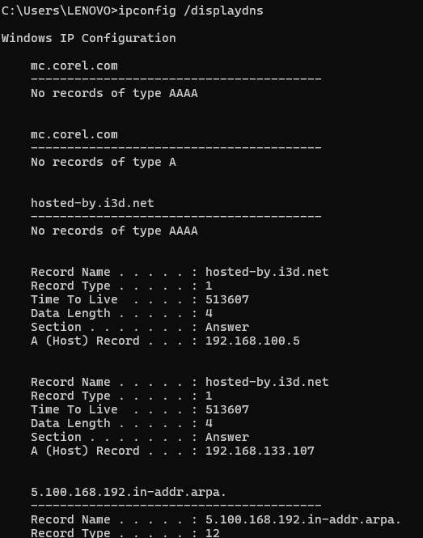
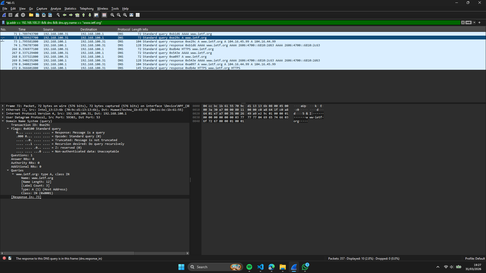
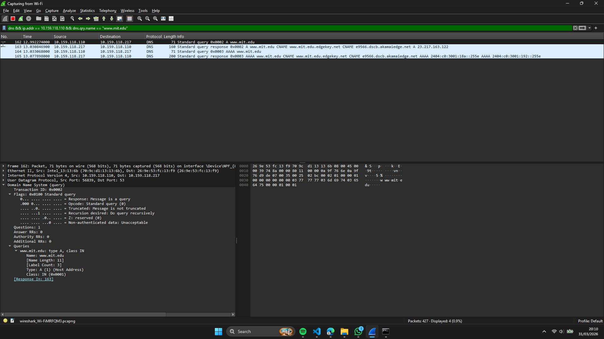

# Laporan Praktikum Jaringan Komputer - Modul 4
## Domain Name System (DNS)

---

## 4.1 Praktikum: Melakukan Query DNS Menggunakan nslookup

### 4.1.1 Query A Record (Pencarian Dasar)
```bash
nslookup www.mit.edu
```
**Keluaran:**
```
Server:  dns.google
Address: 8.8.8.8

Non-authoritative answer:
Name:    e9566.dscb.akamaiedge.net
Addresses:  2001:4488:f931:2ac::255e
            2001:4488:f931:29e::255e
            23.217.163.122
Aliases:  www.mit.edu
          www.mit.edu.edgekey.net
```


**Hal yang Perlu Dicatat:**
- Permintaan dijawab oleh DNS publik Google (`8.8.8.8`)
- Jawaban bersifat *non-authoritative* (dari cache, bukan server otoritatif)
- CNAME chaining terlihat via field `Aliases`: www.mit.edu → www.mit.edu.edgekey.net → e9566.dscb.akamaiedge.net
- Domain memakai CDN Akamai; terdapat alamat IPv6 sekaligus IPv4 (23.217.163.122)

---

### 4.1.2 Query NS Record (Name Server)
```bash
nslookup -type=NS mit.edu
```
**Keluaran:**
```
mit.edu   nameserver = ns1-37.akam.net
mit.edu   nameserver = ns1-173.akam.net
mit.edu   nameserver = asia2.akam.net
mit.edu   nameserver = asia1.akam.net
mit.edu   nameserver = use2.akam.net
mit.edu   nameserver = use5.akam.net
mit.edu   nameserver = usw2.akam.net
mit.edu   nameserver = eur5.akam.net
```


**Pembahasan:**
- Hasilnya berupa daftar server DNS yang menjadi otoritas atas domain tersebut
- Pengelolaan DNS milik MIT dipercayakan kepada layanan Akamai

---

### 4.1.3 Query ke Server DNS Tertentu
```bash
nslookup www.aiit.or.kr 8.8.8.8
```
**Keluaran:**
```
Server:  dns.google
Address: 8.8.8.8

Non-authoritative answer:
Name:    www.aiit.or.kr
Addresses:  2606:4700:3031::ac43:9878
            2606:4700:3036::6815:4a08
            104.21.74.8
            172.67.152.120
```


**Hasil Query via 8.8.8.8:**
| Aspek | Nilai |
|-------|-------|
| Server DNS | dns.google (8.8.8.8) |
| Alamat IPv4 | 104.21.74.8, 172.67.152.120 |
| Alamat IPv6 | 2606:4700:3031::ac43:9878, 2606:4700:3036::6815:4a08 |
| CDN | Cloudflare (dual-stack: IPv4 dan IPv6) |

---

### 4.1.4 Query MX Record (Mail Server)
```bash
nslookup -type=MX yahoo.com 8.8.8.8
```
**Keluaran:**
```
yahoo.com   MX preference = 1, mail exchanger = mta6.am0.yahoodns.net
yahoo.com   MX preference = 1, mail exchanger = mta5.am0.yahoodns.net
yahoo.com   MX preference = 1, mail exchanger = mta7.am0.yahoodns.net
```


**Keterangan:**
- Nilai `1` merupakan priority (nilai yang lebih kecil berarti lebih diutamakan)
- Yahoo menyiapkan beberapa mail server demi keperluan redundansi

---

## 4.2 Pengelolaan DNS Cache pada Windows

| Perintah | Kegunaan | Ringkasan Keluaran |
|----------|--------|---------------|
| `ipconfig /all` | Menampilkan keseluruhan konfigurasi jaringan | IP, Gateway, DNS Server |
| `ipconfig /displaydns` | Menampilkan isi cache DNS lokal | Daftar domain beserta sisa TTL |
| `ipconfig /flushdns` | Membersihkan isi cache DNS | "Successfully flushed" |

**Cuplikan Keluaran `displaydns`:**
```
hosted-by.i3d.net
----------------------------------------
No records of type AAAA

Record Name . . . . . : hosted-by.i3d.net
Record Type . . . . . : 1
Time To Live  . . . . : 513607
Data Length . . . . . : 4
Section . . . . . . . : Answer
A (Host) Record . . . : 192.168.100.5
```


---

## 4.3 Pengamatan Paket DNS Menggunakan Wireshark

### 4.3.1 Menangkap Trafik DNS (Membuka www.ietf.org)
**Tahapan:**
1. Jalankan `ipconfig /flushdns` untuk mengosongkan cache
2. Mulai proses capture di Wireshark
3. Buka `http://www.ietf.org` melalui peramban
4. Terapkan filter: `dns && ip.addr == 10.159.118.110`

**Hasil Tangkapan:**


| Parameter | Query | Response |
|-----------|-------|----------|
| Protokol | UDP | UDP |
| Source Port | 54321 (ephemeral) | 53 |
| Dest Port | 53 | 54321 (ephemeral) |
| Jenis Query | A, AAAA | A, AAAA |
| Jumlah Answer | 0 | 4 (2x IPv4 + 2x IPv6) |

**Isi Jawaban DNS Response:**
```
Answers:
  www.ietf.org → 104.16.45.99   (A record)
  www.ietf.org → 104.16.44.99   (A record)
  www.ietf.org → 2606:4700::... (AAAA record)
  www.ietf.org → 2606:4700::... (AAAA record)
```

**Catatan Pengamatan:**
- DNS berjalan di atas **UDP port 53** (bukan TCP)
- Adanya beberapa alamat IP menandakan load balancing / redundansi
- Begitu DNS response diterima, klien mengirim **TCP SYN** ke salah satu IP hasil resolusi
- Tidak diperlukan query ulang untuk tiap sumber daya (gambar, CSS) berkat adanya **cache DNS + TTL**

---

### 4.3.2 Query www.mit.edu via Wireshark dan nslookup
```bash
nslookup www.mit.edu
```
**Tangkapan Wireshark:**


**Alur Resolusi (CNAME Chaining):**
```
www.mit.edu 
   → CNAME: www.mit.edu.edgekey.net 
   → CNAME: e9566.dscb.akamaiedge.net 
   → A: 23.217.163.122
```

**Rincian Response:**
| Record | Type | Value | TTL |
|--------|------|-------|-----|
| 1 | CNAME | www.mit.edu.edgekey.net | 1495s |
| 2 | CNAME | e9566.dscb.akamaiedge.net | 295s |
| 3 | A | 23.217.163.122 | 20s |

**Intisari:**
- MIT memakai **Akamai CDN**, sehingga resolusi menempuh beberapa CNAME terlebih dahulu sebelum memperoleh IP final
- Nilai TTL bervariasi antar record, memberikan kendali cache yang lebih rinci
- CNAME chaining menghasilkan beberapa hop resolusi sebelum IP final diperoleh

---

### 4.3.3 Query www.aiit.or.kr ke DNS Publik (8.8.8.8)
```bash
nslookup www.aiit.or.kr 8.8.8.8
```
**Filter Wireshark:**
```
dns && ip.addr == 10.159.118.110 && dns.qry.name == "www.aiit.or.kr"
```

**Hasil:**
| Parameter | Nilai |
|-----------|-------|
| Server DNS | 8.8.8.8 (Google Public DNS) |
| Jenis Query | A (IPv4) + AAAA (IPv6) |
| Jawaban A | 172.67.152.120, 104.21.74.8 |
| Jawaban AAAA | 2606:4700:3031::ac43:9878, 2606:4700:3036::6815:4a08 |
| TTL | 300 detik |

**Pembahasan:**
- Rentang IP yang muncul masuk ke wilayah **Cloudflare**, menandakan domain ini memanfaatkan CDN
- Permintaan ke DNS publik berjalan lebih lambat dibanding DNS lokal (akibat jarak dan jumlah hop)
- Bersifat dual-stack: mendukung IPv4 sekaligus IPv6

---

## 4.4 Rangkuman Hasil Praktikum

| Parameter | Nilai / Keterangan |
|-----------|-------------------|
| Protokol DNS | UDP port 53 (umumnya), TCP bila response melebihi 512 byte |
| Jenis Query yang Diuji | A, AAAA, NS, MX |
| CNAME Chaining | Muncul pada domain berbasis CDN (MIT, aiit.or.kr) |
| Beberapa IP per Domain | Ya, untuk load balancing / redundansi |
| Cache DNS | Berlaku selama TTL (kisaran detik-menit) |
| Dual-stack | IPv4 dan IPv6 tersedia pada domain CDN modern |
| Perkakas Utama | `nslookup`, `ipconfig`, Wireshark |

---

## 4.5 Simpulan Praktis

1. DNS bertugas mengubah nama domain menjadi alamat IP; alurnya menyusuri hierarki: klien → DNS lokal → root/TLD → server otoritatif.
2. `nslookup` sangat berguna untuk menguji berbagai jenis record: A (IP), NS (name server), maupun MX (mail server).
3. Pertukaran DNS pada umumnya memakai **UDP port 53** karena ringan; TCP baru digunakan apabila response berukuran besar atau saat zone transfer.
4. Sebuah domain dapat memiliki **beberapa IP** (load balancing) sekaligus **CNAME chaining** (CDN semacam Cloudflare/Akamai).
5. **Cache DNS + TTL** memperkecil query yang berulang; pembersihan cache dibutuhkan ketika menguji perubahan konfigurasi DNS.
6. DNS lokal pada umumnya merespons lebih cepat daripada DNS publik berkat kedekatan lokasi serta cache lokal.
7. Wireshark mempermudah pengamatan alur query-response, susunan paket, dan waktu resolusi DNS.