# DNS 

## Tracing DNS dengan wireshark

1. Pesan permintaan dns pada www.ietf.org 

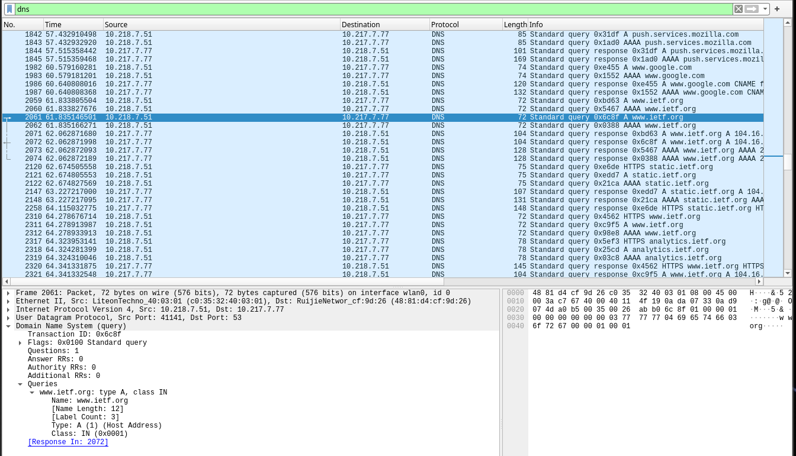

2. Source port dan destination port dns

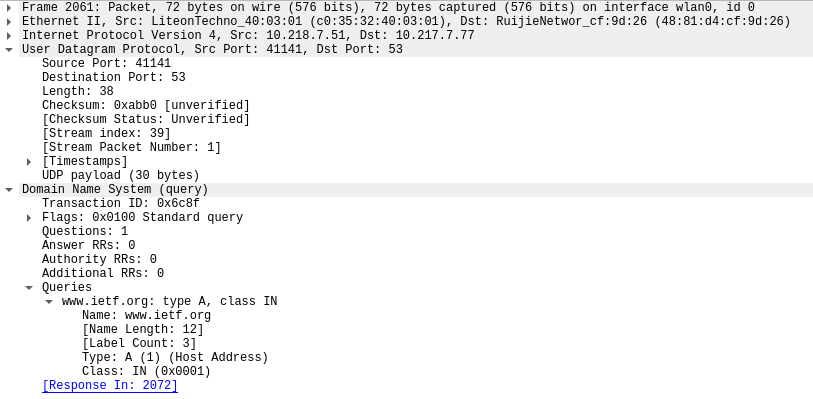

3. Alamat ip tujuan terletak di destination address dan ip pengirim berada di source address  

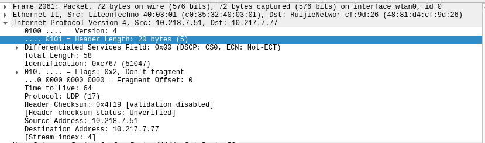

perbandingan dengan alamat ip lokal

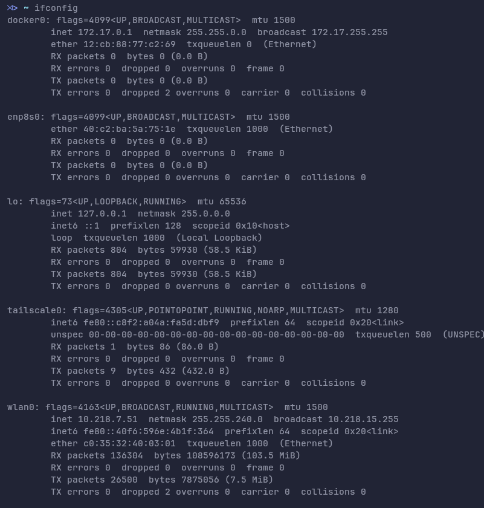

4. Permintaan dns tidak memiliki jawaban

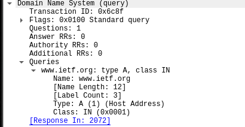

5. Permintaan dns dijawab pada response selanjutnya 

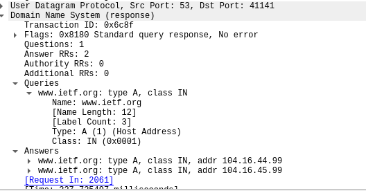

6. Source Address pada paket tcp syn cocok dengan ip di response dns

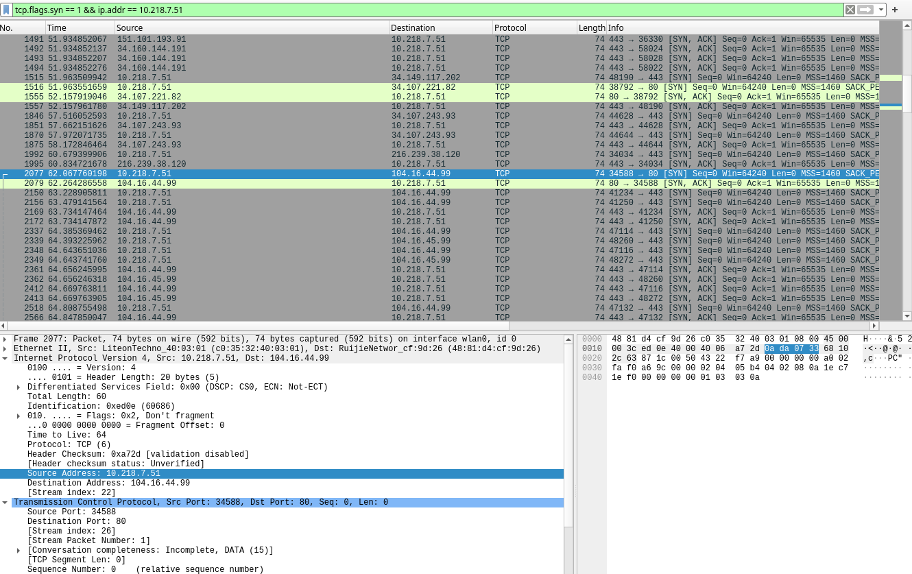

7. browser tidak perlu mengirim dns baru untuk setaip gambar pada web ietf.org karena ada dns caching yang menyimpan alamat ip website di cache dan jika ada beberapa gambar maka akan reqquest ke alamat yang ada di cache tidak perlu melakukan dns query ulang

## Bermain dengan nslookup dan wireshark

1. port asal dan port tujuan dapat dilihat udp 

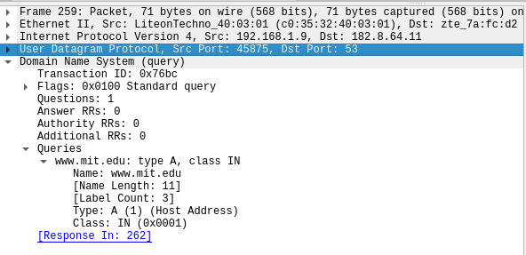

2. dns query dikirimkan ke alamat dns lokal saya 182.8.64.11

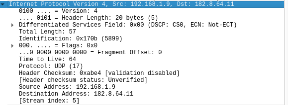

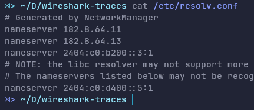

3. pada dns request tidak memiliki answer

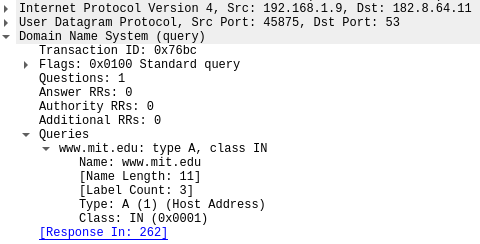

4. dns response memiliki part answer yang berisi 

jumlah pertannyaan (Questions)
jumlah jawaban (Answer RRs)
pertanyaannya (Queries):
- www.mit.edu
- type A (ipv4)
- class IN (internet)

jawabannya (Answers) ada 3 sesuai Answer RRs
- www.mit.edu 
    - type cname/alias untuk www.mit.edu.edgekey.net
- www.mit.edu.edgekey.net
    - type cname/alias lagi ke e9566.dscb.akamaiedge.net
- e9566.dscb.akamaiedge.net
    - type A/alamat ipv4 ke ip 23.217.163.122

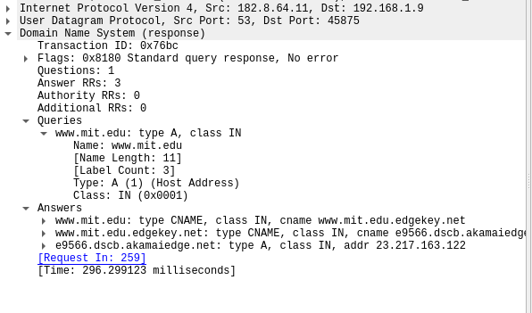

## Dengan -type=NS

1. alamat tujuan adalah alamat ip dns server lokal saya

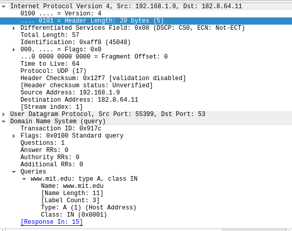

2. Dns query tidak memiliki answer ditandai dengan Answer RRs: 0

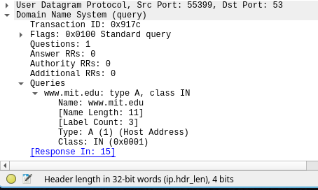

3. dns response memberi 3 jawaban 2 alias dan 1 ip address mit 

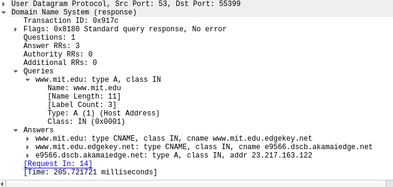

## Dengan custom dns server

Disini nslookup dijalankan dengan 2 parameter
pertama server tujuan dan kedua dns servernya

misalnya

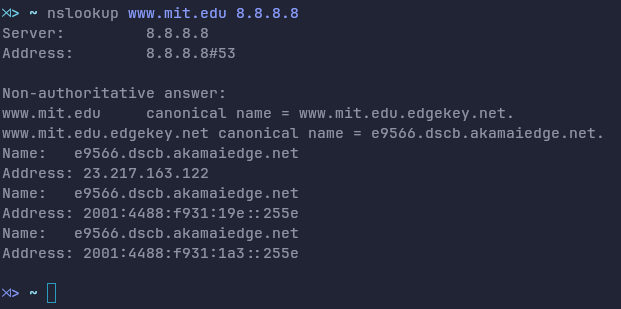

disini akan menggunakan dns google sebagai server dan bukan dns lokal lagi

1. alamat tujuan adalah alamat dns server ang dimasukkan di parameter kedua

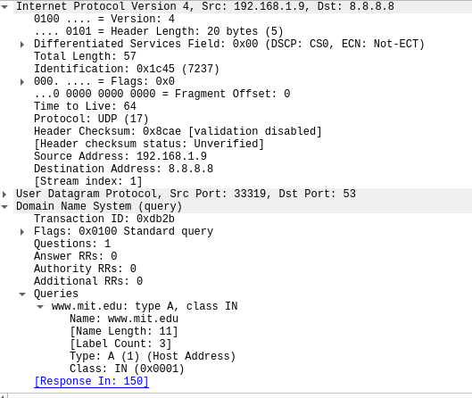

2. dns query tidak memiliki answer

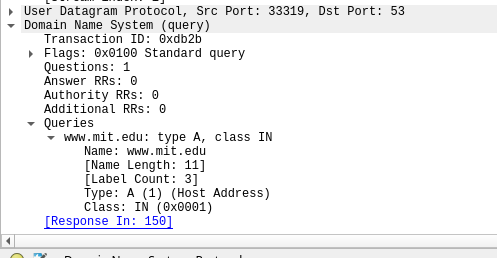

3. dns response memiliki 3 answer termasuk ip server mit itu sendiri

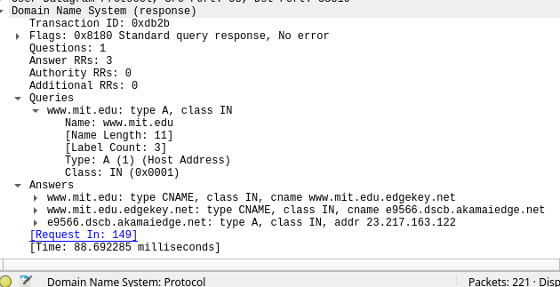
