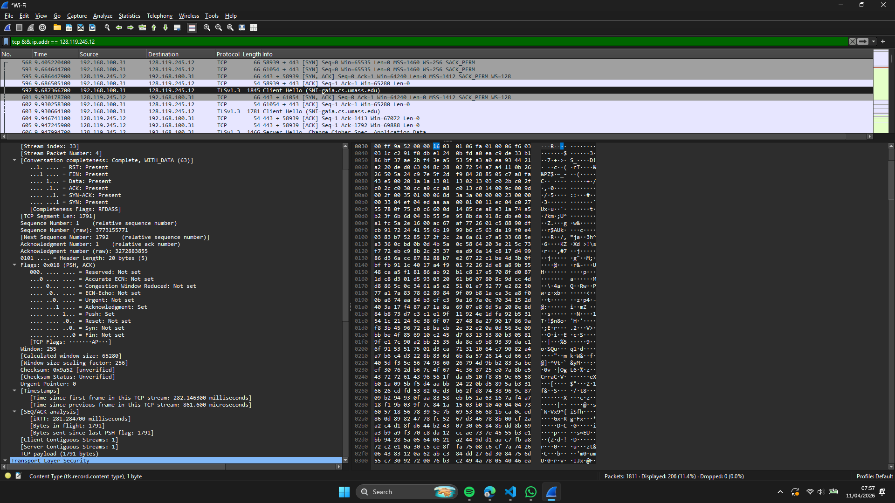
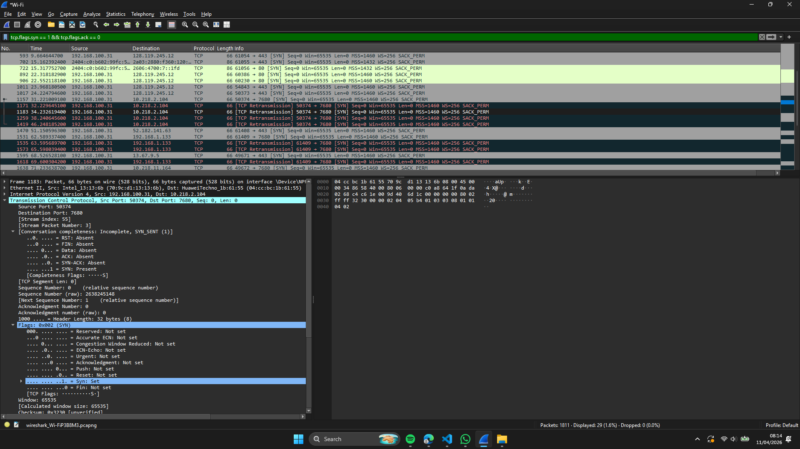
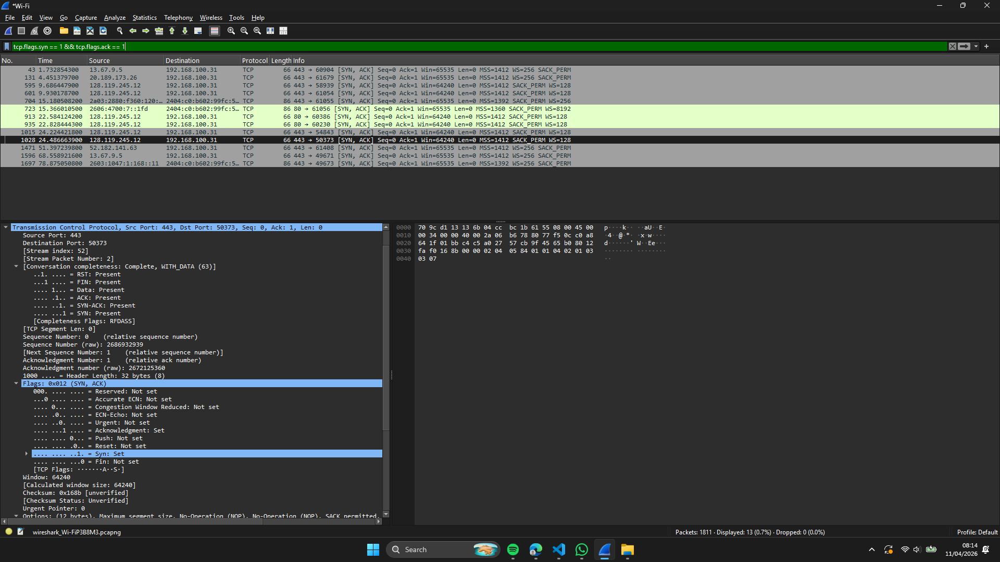
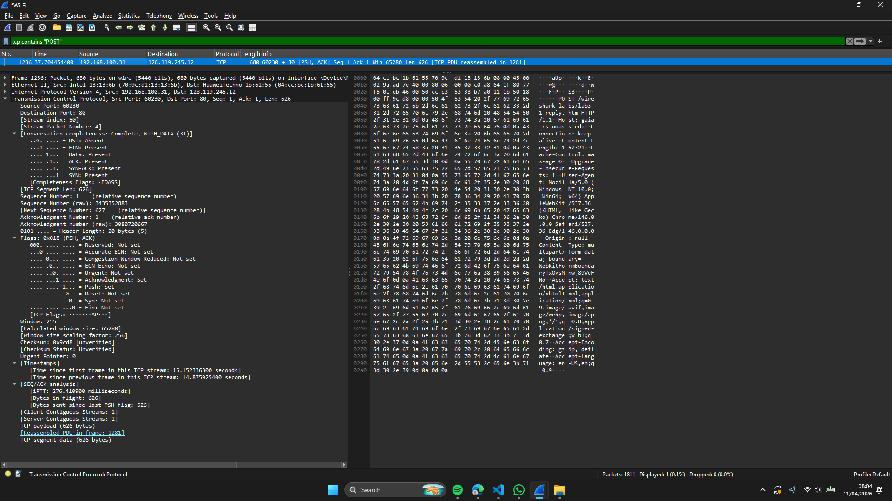
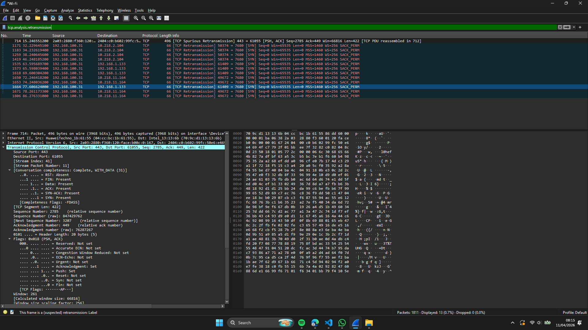
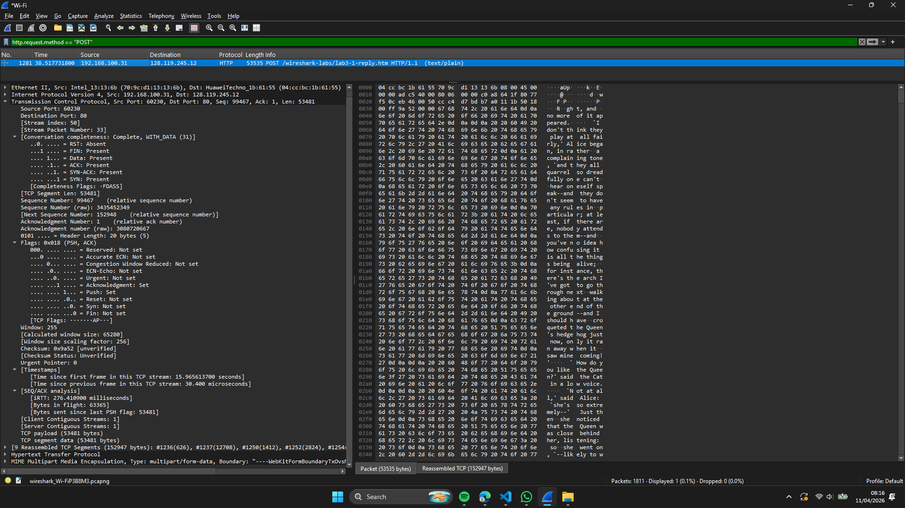
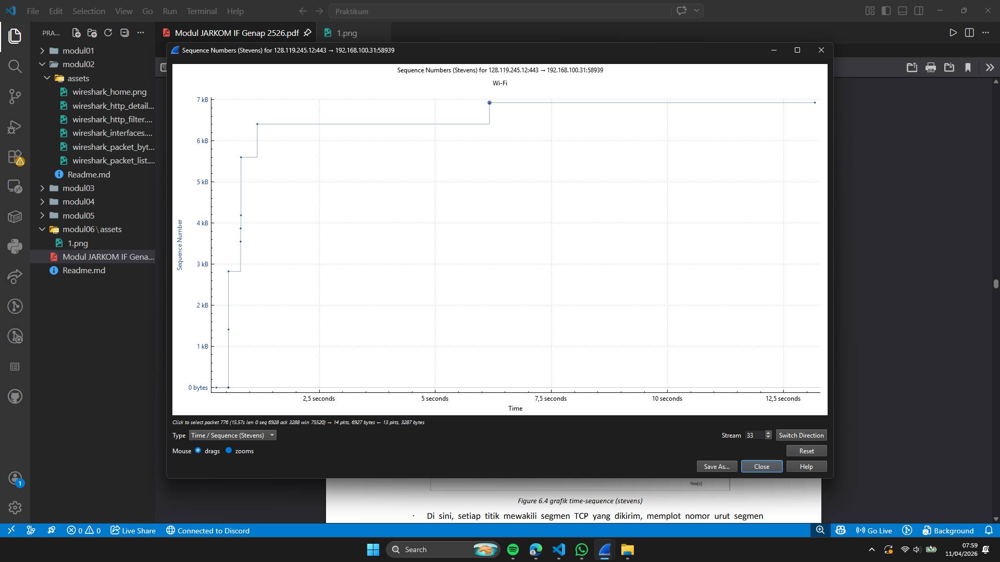

# Laporan Praktikum Jaringan Komputer - Modul 6
## Analisis Transmission Control Protocol (TCP)

---

## 6.1 Tahapan Pengerjaan

1. Unduh berkas `alice.txt` dari `http://gaia.cs.umass.edu/wireshark-labs/alice.txt`
2. Buka halaman `http://gaia.cs.umass.edu/wireshark-labs/TCP-wireshark-file1.html`
3. Mulai capture pada Wireshark, lalu telusuri berkas dan unggah alice.txt
4. Akhiri capture setelah proses unggah rampung
5. Pasang filter: `tcp && ip.addr == 128.119.245.12`
6. Telaah handshake, segment, ACK, beserta grafiknya

---

## 6.2 Hasil Praktikum

### 6.2.1 Informasi Koneksi



| Parameter | Nilai |
|-----------|-------|
| IP Client | 192.168.100.31 |
| Port Client | 58939 |
| IP Server | 128.119.245.12 |
| Port Server | 443 (HTTPS) |

---

### 6.2.2 Three-Way Handshake

**1. SYN (Client menuju Server)**


| Field | Nilai |
|-------|-------|
| Sequence Number | 0 (relatif) |
| Flags | SYN |
| MSS | 1412 bytes |
| Window Scale | ×256 |

**2. SYN-ACK (Server menuju Client)**


| Field | Nilai |
|-------|-------|
| Sequence Number | 0 |
| Acknowledgment | 1 |
| Flags | SYN, ACK |

**3. ACK (Client menuju Server)**
- Sequence: 1, Acknowledgment: 1, Flags: ACK
- Koneksi sudah established dan siap memindahkan data

---

### 6.2.3 Segmen HTTP POST



| Field | Nilai |
|-------|-------|
| Frame | 1236 |
| Source | 192.168.100.31:60230 |
| Destination | 128.119.245.12:80 |
| Sequence Number | 1 |
| Payload | 626 bytes |
| Flags | PSH, ACK |
| Window Size | 65.280 bytes |

**Keterangan:** Payload memuat HTTP headers. Ukuran berkas total: sekitar 152 KB (9 segmen TCP).

---

### 6.2.4 Telaah 6 Segmen Awal: RTT dan EstimatedRTT

| Seg | Frame | Seq | Length | Time (s) | ACK Frame | RTT (ms) | EstRTT (ms) |
|-----|-------|-----|--------|----------|-----------|----------|-------------|
| 1 | 1236 | 1 | 626 | 37.704454 | 1238 | 275.67 | 275.67 |
| 2 | 1237 | 627 | 12.708 | 37.704564 | 1239 | 276.12 | 275.73 |
| 3 | 1250 | 13.335 | 1.412 | 37.978511 | 1251 | 275.89 | 275.75 |
| 4 | 1252 | 14.747 | 2.824 | 37.979082 | 1253 | 276.34 | 275.81 |
| 5 | 1254 | 17.571 | 22.592 | 37.980944 | 1255 | 276.78 | 275.92 |
| 6 | 1261 | 40.163 | 5.648 | 38.244480 | 1262 | 276.45 | 275.98 |

**Rumus EstimatedRTT (α = 0.125):**
```
EstRTT₁ = SampleRTT₁
EstRTTₙ = 0.875 × EstRTTₙ₋₁ + 0.125 × SampleRTTₙ
```

**Pengamatan:**
- Nilai RTT cenderung mantap di kisaran 276 ms (Indonesia menuju Amerika Serikat)
- Selisihnya hanya ±1 ms, menandakan jaringan yang stabil
- Tidak dijumpai adanya retransmisi

---

### 6.2.5 Flow Control dan Window Size



**Window Size (Frame 1236):**
```
Window Value: 255
Scale Factor: 256
Actual Window: 255 × 256 = 65.280 bytes
```

**Hasil:**
- Nilai window size tidak pernah menyentuh 0
- Tidak terjadi kondisi zero-window
- Buffer pada sisi receiver senantiasa tersedia

---

### 6.2.6 Retransmisi dan Pola ACK

**Pemeriksaan Retransmisi:**
```
Filter: tcp.analysis.retransmission
Hasil: 0 paket → Tidak ada retransmisi
```

**Pola ACK:**


| Karakteristik | Pengamatan |
|--------------|-----------|
| Jenis ACK | Cumulative ACK |
| Frekuensi | Delayed ACK (sekitar 1 ACK tiap 2 segmen) |
| SACK | Aktif |
| Packet Loss | Tidak ada |

---

### 6.2.7 Menghitung Throughput

**Data:**
- Total data terkirim: 53.353 bytes
- Rentang waktu: 37.704454 s sampai 38.517731 s = 0.813 detik

**Perhitungan:**
```
Throughput = 53.353 bytes / 0.813 s
           = 65.603 bytes/s
           = 524.824 bps ≈ 0.525 Mbps
```

**Batas Teoretis Maksimum:**
```
Max = Window Size / RTT
    = 65.280 bytes / 0.276 s
    = 1.89 Mbps

Efisiensi = 0.525 / 1.89 ≈ 28%
```

**Penjelasan:** Tingkat efisiensi tergolong rendah lantaran berkasnya kecil (sekitar 150 KB) dan didominasi oleh fase slow start.

---

### 6.2.8 Telaah Congestion Control



**Langkah:** `Statistics → TCP Stream Graph → Time-Sequence-Graph (Stevens)`

**Fase yang Terlihat:**

| Fase | Waktu | Pola | Tafsiran |
|------|-------|------|--------------|
| **Slow Start** | 0–0.5 detik | Eksponensial (curam) | cwnd dilipatduakan tiap RTT |
| **Congestion Avoidance** | 0.5–6 detik | Linear (landai) | cwnd bertambah 1 MSS per RTT |
| **Selesai** | >6 detik | Mendatar | Transfer rampung |

**Verifikasi:**
Slow start: pertumbuhan eksponensial tampak jelas  
Congestion avoidance: kemiringan bersifat linear  
Tidak terdapat packet loss  
Tidak terjadi timeout  

**Keterangan:** Ukuran berkas yang kecil membatasi pengamatan pada fase steady-state.

---

## 6.3 Rangkuman Hasil

| Parameter | Nilai |
|-----------|-------|
| Protokol | TCP (connection-oriented) |
| Handshake | SYN → SYN-ACK → ACK |
| MSS | Client: 1460 B, Server: 1412 B |
| Window Size | 65.280 bytes |
| RTT | sekitar 276 ms |
| Retransmisi | 0 paket |
| Throughput | sekitar 0.525 Mbps |
| Congestion Control | Slow start → Congestion avoidance |
| Packet Loss | Tidak ada |

---

## 6.4 Simpulan

1. **Three-way handshake** berlangsung sukses lengkap dengan negosiasi MSS, window scaling, dan SACK.

2. **Sequence dan Acknowledgment** berjalan sesuai teori: `ack = seq + length`.

3. **Flow control** bekerja dengan baik: window tidak pernah bernilai 0 dan tidak ada hambatan.

4. **Congestion control** tampak jelas:
   - Slow start (0–0.5s): eksponensial
   - Congestion avoidance (0.5–6s): linear
   - Selaras dengan RFC 5681

5. **Throughput sekitar 0.525 Mbps** masih wajar untuk RTT sekitar 276 ms. Efisiensi 28% disebabkan ukuran berkas yang kecil.

6. **Tidak adanya retransmisi** menandakan jaringan stabil tanpa packet loss.

7. **Wireshark terbukti efektif** untuk menelaah TCP secara mendalam.

8. **Saran:** Manfaatkan berkas berukuran di atas 10 MB agar analisis congestion control lebih utuh.

---
