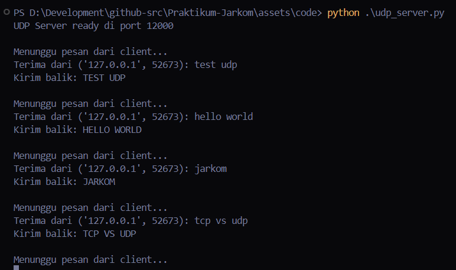
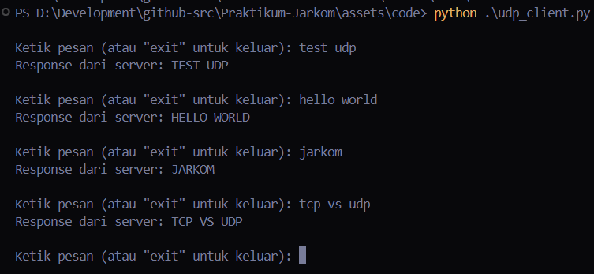
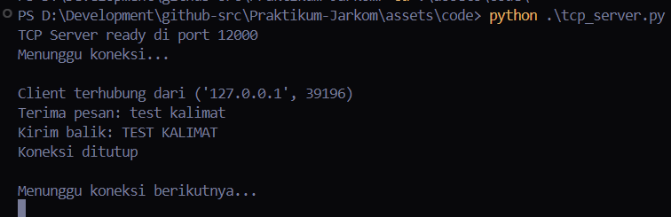
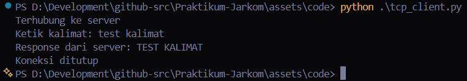

# Laporan Praktikum Jaringan Komputer - Modul 7
## Pemrograman Socket: UDP dan TCP

---

## 7.1 Praktikum Socket UDP

### 7.1.1 Kode Program Server UDP

**Berkas:** `udp_server.py`

```python
from socket import *

serverPort = 12000
serverSocket = socket(AF_INET, SOCK_DGRAM)
serverSocket.bind(('', serverPort))

print("The server is ready to receive")

while True:
    message, clientAddress = serverSocket.recvfrom(2048)
    modifiedMessage = message.decode().upper()
    serverSocket.sendto(modifiedMessage.encode(), clientAddress)
```

**Uraian:**
- Server menciptakan socket UDP melalui `SOCK_DGRAM`
- Mengikat (bind) socket ke port 12000
- Menjalankan perulangan tanpa henti guna menerima pesan dari client
- Pesan diubah menjadi huruf kapital lalu dikirim kembali

---

### 7.1.2 Kode Program Client UDP

**Berkas:** `udp_client.py`

```python
from socket import *

serverName = 'localhost'
serverPort = 12000

clientSocket = socket(AF_INET, SOCK_DGRAM)
message = input('Input lowercase sentence: ')
clientSocket.sendto(message.encode(), (serverName, serverPort))

modifiedMessage, serverAddress = clientSocket.recvfrom(2048)
print(modifiedMessage.decode())

clientSocket.close()
```

**Uraian:**
- Client membentuk socket UDP (tanpa perlu melakukan bind port)
- Pesan langsung dikirim ke server memakai `sendto()`
- Balasan diterima melalui `recvfrom()`
- `connect()` tidak diperlukan karena UDP bersifat connectionless

---

### 7.1.3 Hasil Menjalankan Program UDP

**Langkah Pengujian:**
1. Buka terminal pertama, lalu jalankan server
2. Buka terminal kedua, kemudian jalankan client
3. Masukkan pesan dan amati hasilnya

**Terminal 1 - UDP Server:**


Server aktif dan menanti pesan yang dikirim client.

**Terminal 2 - UDP Client:**


Client mengirimkan pesan lalu memperoleh balasan dari server.

**Hasil:**
- Masukan: `hello world`
- Keluaran dari server: `HELLO WORLD`
- Pesan berhasil diubah menjadi huruf kapital

---

## 7.2 Praktikum Socket TCP

### 7.2.1 Kode Program Server TCP

**Berkas:** `tcp_server.py`

```python
from socket import *

serverPort = 12000
serverSocket = socket(AF_INET, SOCK_STREAM)
serverSocket.bind(('', serverPort))
serverSocket.listen(1)

print('The server is ready to receive')

while True:
    connectionSocket, addr = serverSocket.accept()
    sentence = connectionSocket.recv(1024).decode()
    capitalizedSentence = sentence.upper()
    connectionSocket.send(capitalizedSentence.encode())
    connectionSocket.close()
```

**Uraian:**
- Server membuat socket TCP dengan `SOCK_STREAM`
- `listen(1)` menandakan kesiapan menerima koneksi (antrian maksimal 1)
- `accept()` menerima koneksi dari client dan menghasilkan `connectionSocket` baru
- Seusai melayani, `connectionSocket.close()` dipanggil (sedangkan serverSocket tetap aktif)

---

### 7.2.2 Kode Program Client TCP

**Berkas:** `tcp_client.py`

```python
from socket import *

serverName = 'localhost'
serverPort = 12000

clientSocket = socket(AF_INET, SOCK_STREAM)
clientSocket.connect((serverName, serverPort))

sentence = input('Input lowercase sentence: ')
clientSocket.send(sentence.encode())

modifiedSentence = clientSocket.recv(1024)
print('From Server:', modifiedSentence.decode())

clientSocket.close()
```

**Uraian:**
- Client membentuk socket TCP
- `connect()` memulai koneksi (melalui 3-way handshake)
- Data dikirim memakai `send()` (alamat tujuan tidak perlu dicantumkan)
- Balasan diterima melalui `recv()`

---

### 7.2.3 Hasil Menjalankan Program TCP

**Langkah Pengujian:**
1. Buka terminal pertama, lalu jalankan server TCP
2. Buka terminal kedua, kemudian jalankan client TCP
3. Ketikkan kalimat dan amati hasilnya

**Terminal 1 - TCP Server:**


Server siap menampung koneksi sekaligus memproses pesan dari client.

**Terminal 2 - TCP Client:**


Client tersambung ke server, mengirim pesan, dan menerima balasannya.

**Hasil:**
- Masukan: `test kalimat`
- Keluaran dari server: `TEST KALIMAT`
- Koneksi TCP terbentuk lebih dulu sebelum data dipindahkan

---

## 7.3 Perbandingan UDP dan TCP (Berdasarkan Praktikum)

### 7.3.1 Perbedaan dari Sisi Implementasi

| Aspek | UDP | TCP |
|-------|-----|-----|
| **Tipe Socket** | `SOCK_DGRAM` | `SOCK_STREAM` |
| **Koneksi** | Tanpa `connect()` | Membutuhkan `connect()` |
| **Socket Server** | 1 socket melayani seluruh client | 2 socket (serverSocket + connectionSocket) |
| **Kirim/Terima** | `sendto()` / `recvfrom()` | `send()` / `recv()` |
| **Alamat** | Wajib mencantumkan alamat | Otomatis (koneksi sudah terbentuk) |

---

### 7.3.2 Perbedaan dari Sisi Eksekusi

| Karakteristik | UDP | TCP |
|--------------|-----|-----|
| **Kecepatan** | Lebih gesit (langsung kirim) | Ada jeda akibat handshake |
| **Server** | Sanggup melayani banyak client serentak | Melayani 1 client setiap saat |
| **Client** | Dapat mengirim berkali-kali | Mengirim sekali, lalu koneksi berakhir |
| **Reliability** | Tanpa jaminan | Data dipastikan sampai |

---

## 7.4 Analisis Praktikum

### 7.4.1 Socket UDP

**Hasil Pengamatan:**
- Server mampu menampung pesan dari berbagai client
- Tidak terlihat adanya proses pembentukan koneksi
- Pesan langsung dikirim sekaligus diterima
- Tidak ada konfirmasi atas keberhasilan pengiriman

**Kelebihan UDP:**
- Implementasinya ringkas
- Tidak menanggung overhead koneksi
- Sesuai untuk aplikasi real-time

**Keterbatasan:**
- Tidak ada jaminan pesan tiba di tujuan
- Tidak ada penataan urutan data
- Tidak ada retransmisi

---

### 7.4.2 Socket TCP

**Hasil Pengamatan:**
- Terdapat proses `connect()` sebelum data dikirim
- Server menyiapkan socket tersendiri bagi tiap client
- Data dipastikan tiba dan tetap berurutan
- Koneksi ditutup setelah layanan rampung

**Kelebihan TCP:**
- Pengiriman bersifat reliable
- Data tersusun rapi
- Tersedia flow control dan congestion control

**Keterbatasan:**
- Overhead-nya lebih besar
- Ada jeda akibat handshake
- Lebih rumit

---

## 7.5 Pengujian Tambahan

### 7.5.1 Banyak Client (UDP)

**Uji:** Jalankan beberapa client secara bersamaan

**Hasil:**
- Server UDP mampu melayani banyak client
- Seluruh client memanfaatkan socket yang sama
- Pesan diolah satu per satu di dalam perulangan

---

### 7.5.2 Banyak Client (TCP)

**Uji:** Coba sambungkan beberapa client

**Hasil:**
- Server TCP melayani client secara berurutan
- Client kedua mesti menanti client pertama selesai
- Tiap client memperoleh `connectionSocket` yang terpisah

**Keterangan:** Agar bisa melayani banyak client secara bersamaan, dibutuhkan penerapan threading.

---

## 7.6 Simpulan

Berdasarkan praktikum yang sudah dijalankan:

1. **Socket UDP:**
   - Lebih sederhana dari sisi implementasi
   - Connectionless (tanpa proses handshake)
   - Cocok bagi aplikasi yang mengedepankan kecepatan
   - Tidak menjamin pengiriman

2. **Socket TCP:**
   - Lebih rumit namun reliable
   - Connection-oriented (memerlukan 3-way handshake)
   - Data dipastikan tiba dan tetap berurutan
   - Cocok bagi aplikasi yang menuntut keandalan

3. **Perbedaan Pokok:**
   - UDP: `sendto()`/`recvfrom()`, server cukup 1 socket
   - TCP: `send()`/`recv()`, server butuh 2 socket
   - TCP memerlukan `connect()`/`listen()`/`accept()`

4. **Pemilihan Protokol:**
   - **UDP** untuk: DNS, streaming, VoIP, gaming
   - **TCP** untuk: Web, email, transfer berkas

5. **Pemrograman socket** memberi kendali penuh atas komunikasi jaringan pada lapisan aplikasi.

---
