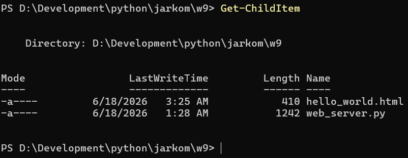
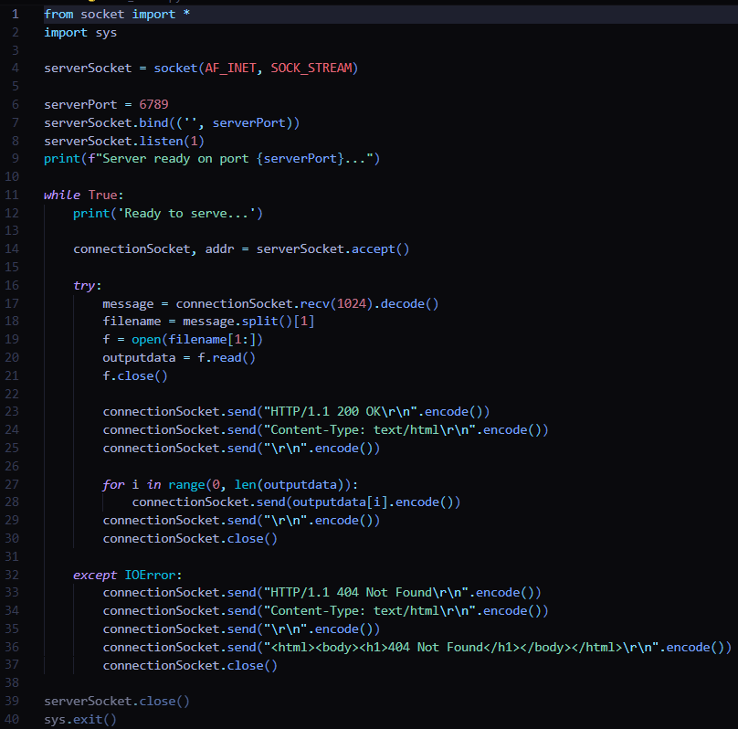
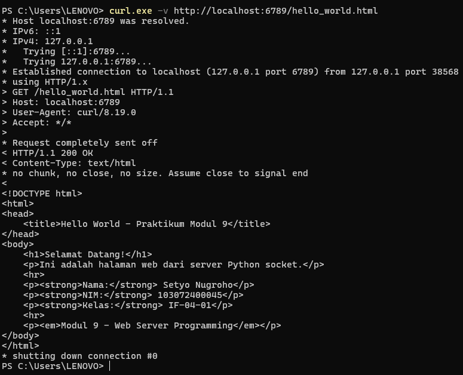
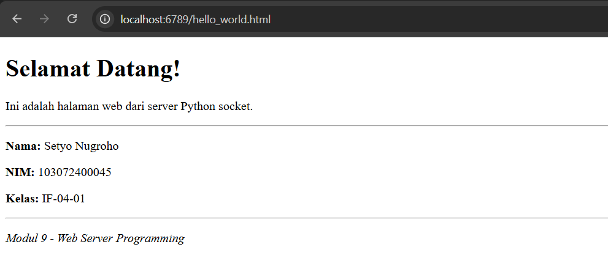
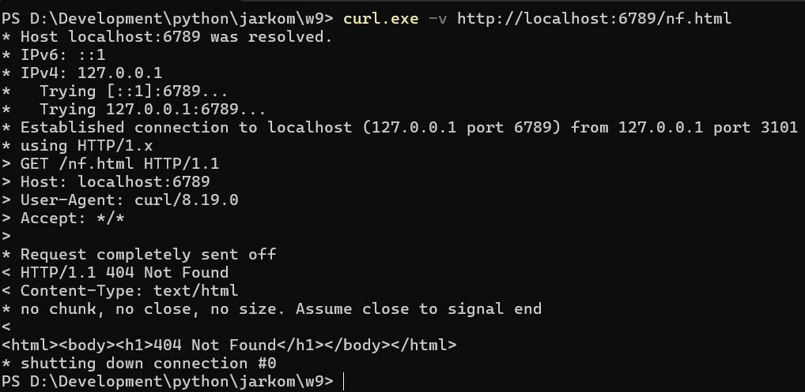
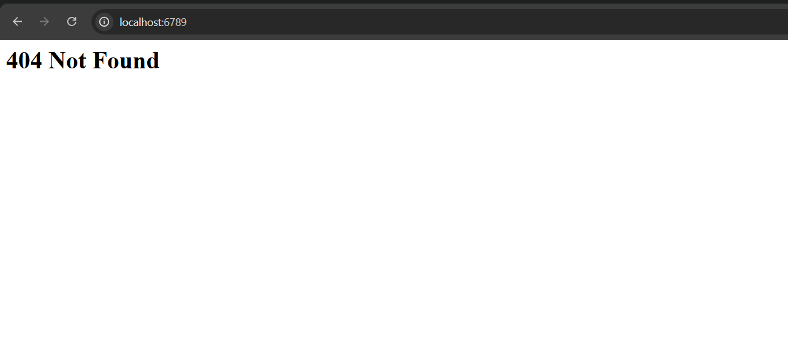

# Laporan Praktikum Jaringan Komputer - Modul 9
## Pemrograman Web Server dengan Socket Python

---

## 9.1 Kode Program Web Server

**Berkas:** `web_server.py`

```python
from socket import *
import sys

serverSocket = socket(AF_INET, SOCK_STREAM)

serverPort = 6789
serverSocket.bind(('', serverPort))
serverSocket.listen(1)
print(f"Server ready on port {serverPort}...")

while True:
    print('Ready to serve...')
    
    connectionSocket, addr = serverSocket.accept()
    
    try:
        message = connectionSocket.recv(1024).decode()
        filename = message.split()[1]
        f = open(filename[1:])
        outputdata = f.read()
        f.close()
        
        connectionSocket.send("HTTP/1.1 200 OK\r\n".encode())
        connectionSocket.send("Content-Type: text/html\r\n".encode())
        connectionSocket.send("\r\n".encode())
        
        for i in range(0, len(outputdata)):
            connectionSocket.send(outputdata[i].encode())
        connectionSocket.send("\r\n".encode())
        connectionSocket.close()
        
    except IOError:
        # Send 404 response
        connectionSocket.send("HTTP/1.1 404 Not Found\r\n".encode())
        connectionSocket.send("Content-Type: text/html\r\n".encode())
        connectionSocket.send("\r\n".encode())
        connectionSocket.send("<html><body><h1>404 Not Found</h1></body></html>\r\n".encode())
        connectionSocket.close()

serverSocket.close()
sys.exit()
```

---

## 9.2 Berkas HTML untuk Pengujian

**Berkas:** `hello_world.html`

```html
<!DOCTYPE html>
<html>
<head>
    <title>Hello World - Praktikum Modul 9</title>
</head>
<body>
    <h1>Selamat Datang!</h1>
    <p>Ini adalah halaman web dari server Python socket.</p>
    <hr>
    <p><strong>Nama:</strong> Setyo Nugroho</p>
    <p><strong>NIM:</strong> 103072400045</p>
    <p><strong>Kelas:</strong> IF-04-01</p>
    <hr>
    <p><em>Modul 9 - Web Server Programming</em></p>
</body>
</html>
```

---

## 9.3 Hasil Praktikum

### 9.3.1 Susunan Folder dan Berkas



Tampak dua berkas pokok:
- **hello_world.html** (410 bytes) — berkas HTML yang akan disajikan
- **web_server.py** (1242 bytes) — program web server berbasis Python

---

### 9.3.2 Source Code Web Server

**Tampilan kode pada VS Code:**



Kode program web server dengan keterangan:
- Baris 1-2: Mengimpor pustaka socket dan sys
- Baris 5-11: Menyiapkan server socket serta mengikatnya ke port 6789
- Baris 13-18: Perulangan untuk menerima koneksi client
- Baris 20-24: Membaca HTTP request lalu membuka berkas
- Baris 26-30: Mengirim HTTP response 200 OK beserta isi berkas
- Baris 32-37: Menangani galat 404 Not Found

---

### 9.3.3 Uji via Browser - Berhasil (200 OK)

**URL:** `http://localhost:6789/hello_world.html`

**Hasil:**



Halaman tampil dengan sempurna berisi:
- Judul "Selamat Datang!"
- Status HTTP **200 OK**

---

### 9.3.4 Uji via Browser - Rincian Halaman

**Tampilan utuh:**




Seluruh elemen HTML ter-render dengan baik:
- Heading H1
- Paragraf yang sudah diberi styling
- Garis horizontal (`<hr>`)
- Pemformatan teks (tebal lewat `<strong>`, miring lewat `<em>`)

---

### 9.3.5 Uji via Browser - Berkas Tidak Tersedia (404 Not Found)

**URL:** `http://localhost:6789/`

**Hasil:**



Server berhasil menangani galat:
- Menampilkan **"404 Not Found"**
- Response HTTP **404** terkirim dengan tepat
- HTML sederhana muncul di peramban

---

### 9.3.6 Uji via curl - Berkas Tidak Tersedia

**Perintah:**
```powershell
curl.exe -v http://localhost:6789/nf.html
```

**Keluaran:**
```
* Host localhost:6789 was resolved.
* IPv6: ::1
* IPv4: 127.0.0.1
*   Trying [::1]:6789...
*   Trying 127.0.0.1:6789...
* Established connection to localhost (127.0.0.1 port 6789) from 127.0.0.1 port 3101
* using HTTP/1.x
> GET /nf.html HTTP/1.1
> Host: localhost:6789
> User-Agent: curl/8.19.0
> Accept: */*
>
* Request completely sent off
< HTTP/1.1 404 Not Found
< Content-Type: text/html
<
<html><body><h1>404 Not Found</h1></body></html>
* shutting down connection #0
```



Response 404 terbukti lewat command line dengan:
- Kode status: **404 Not Found**
- Content-Type: **text/html**
- Body: HTML dengan heading "404 Not Found"

---

### 9.3.7 Uji via curl - Berkas Tersedia (200 OK)

**Perintah:**
```powershell
curl -v http://localhost:6789/hello_world.html
```

**Keluaran:**
```
StatusCode        : 200
StatusDescription : OK
Content           : <!DOCTYPE html>
                    <html>
                    <head>
                        <title>Hello World - Praktikum Modul 9</title>
                    </head>
                    <body>
                        <h1>Selamat Datang!</h1>
                        <p>Ini adalah halaman web dari server Python socket.</p>
                        ...

RawContent        : HTTP/1.1 200 OK
                    Content-Type: text/html
                    <!DOCTYPE html>...
```


Response yang lengkap memperlihatkan:
- Kode status **200 OK**
- Content-Type: **text/html**
- Isi berkas HTML ter-parse seluruhnya dengan benar

---

## 9.4 Telaah HTTP Request/Response

### 9.4.1 HTTP Request (dari Browser)
```
GET /hello_world.html HTTP/1.1
Host: localhost:6789
User-Agent: Mozilla/5.0 (Windows NT 10.0; Win64; x64)...
Accept: text/html,application/xhtml+xml,application/xml;q=0.9,*/*;q=0.8
Accept-Language: en-US,en;q=0.5
Connection: keep-alive
```

### 9.4.2 HTTP Response (200 OK)
```
HTTP/1.1 200 OK
Content-Type: text/html

<!DOCTYPE html>
<html>
<head>
    <title>Hello World - Praktikum Modul 9</title>
</head>
<body>
    <h1>Selamat Datang!</h1>
    <p>Ini adalah halaman web dari server Python socket.</p>
    <hr>
    <p><em>Modul 9 - Web Server Programming</em></p>
</body>
</html>
```

### 9.4.3 HTTP Response (404 Not Found)
```
HTTP/1.1 404 Not Found
Content-Type: text/html

<html><body><h1>404 Not Found</h1></body></html>
```

---

## 9.5 Penjelasan Kode

### 9.5.1 Menyiapkan Server Socket
```python
serverSocket = socket(AF_INET, SOCK_STREAM)
serverPort = 6789
serverSocket.bind(('', serverPort))  
serverSocket.listen(1)                
print(f"Server ready on port {serverPort}...")
```
- Membentuk socket TCP memakai `AF_INET` (IPv4) dan `SOCK_STREAM` (TCP)
- Mengikat ke port **6789** pada seluruh network interface
- Server mulai listening menanti koneksi masuk

### 9.5.2 Menerima Koneksi Client
```python
while True:
    print('Ready to serve...')
    connectionSocket, addr = serverSocket.accept()
```
- Perulangan tanpa batas untuk melayani banyak permintaan
- `accept()` menghasilkan socket khusus (`connectionSocket`) bagi client ini
- `addr` memuat pasangan (IP_client, port_client)

### 9.5.3 Membaca HTTP Request
```python
try:
    message = connectionSocket.recv(1024).decode()
    filename = message.split()[1]     
    f = open(filename[1:])             
    outputdata = f.read()
    f.close()
```
- Menerima HTTP request (maksimal 1024 bytes) lalu mengubahnya dari bytes ke string
- Memecah message dan mengambil elemen kedua (filename)
- Membuang karakter "/" pertama lewat `filename[1:]`
- Membaca isi berkas ke variabel `outputdata`

### 9.5.4 Mengirim HTTP Response (200 OK)
```python
connectionSocket.send("HTTP/1.1 200 OK\r\n".encode())
connectionSocket.send("Content-Type: text/html\r\n".encode())
connectionSocket.send("\r\n".encode())  

for i in range(0, len(outputdata)):
    connectionSocket.send(outputdata[i].encode())
connectionSocket.send("\r\n".encode())
connectionSocket.close()
```
- **Status line:** `HTTP/1.1 200 OK`
- **Header:** `Content-Type: text/html`
- **Baris kosong:** `\r\n` menandai berakhirnya headers
- **Body:** Mengirim isi berkas karakter demi karakter
- Koneksi ditutup ketika selesai

### 9.5.5 Menangani Galat (404 Not Found)
```python
except IOError:
    connectionSocket.send("HTTP/1.1 404 Not Found\r\n".encode())
    connectionSocket.send("Content-Type: text/html\r\n".encode())
    connectionSocket.send("\r\n".encode())
    connectionSocket.send("<html><body><h1>404 Not Found</h1></body></html>\r\n".encode())
    connectionSocket.close()
```
- Apabila berkas tidak ditemukan, dilemparkan `IOError`
- Mengirim response **404 Not Found**
- Menyertakan HTML ringkas berisi pesan galat
- Menutup koneksi client

---

## 9.6 Simpulan

Berdasarkan praktikum yang sudah dijalankan:

1. **Web server berhasil dibangun** hanya dengan sekitar 40 baris kode Python memakai pemrograman socket TCP.

2. **Server beroperasi di port 6789** dan dapat diakses lewat:
   - Peramban: `http://localhost:6789/hello_world.html` 
   - Command line: `curl http://localhost:6789/hello_world.html`

3. **HTTP Response berhasil diterapkan:**
   - Status **200 OK** bagi berkas yang tersedia
   - Status **404 Not Found** bagi berkas yang tidak ada
   - Header Content-Type terkirim dengan tepat

4. **Format HTTP sesuai standar RFC 7230:**
   - Request: `GET /filename HTTP/1.1` beserta headers
   - Response: `HTTP/1.1 STATUS_CODE` + headers + baris kosong + body

5. **Penanganan server berlangsung mulus:**
   - `accept()` membuat socket khusus untuk tiap client
   - `recv()` membaca HTTP request
   - Parsing filename, membuka berkas, lalu mengirim response
   - `close()` menutup koneksi seusai melayani

6. **Penanganan galat** lewat try-except sukses menangani berkas yang tidak ditemukan (IOError).

7. **Pengujian menyeluruh** melalui peramban dan curl menunjukkan server bekerja baik pada kedua skenario (berkas ada dan berkas tidak ada).

8. **Susunan folder** tertata rapi dengan berkas HTML dan server Python berada pada direktori yang sama.

---
